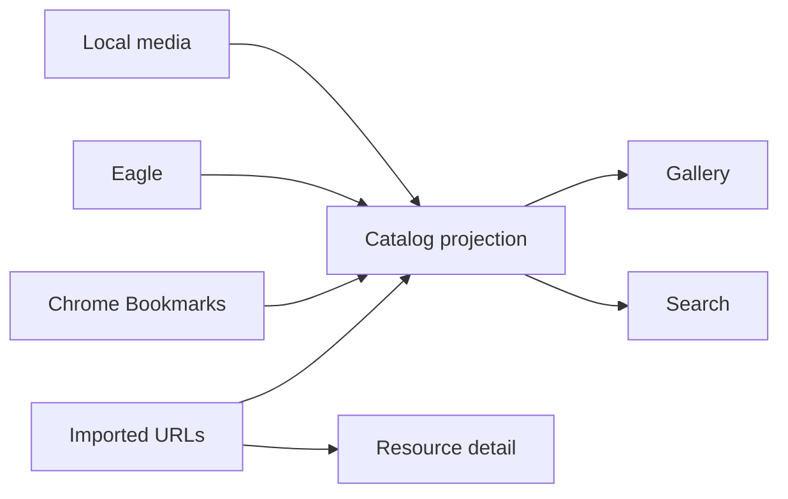

# Flowinone — multi-source resource renderer

Flowinone is a local-first renderer for visual media, bookmarks, and imported web resources. It lets you browse or search across Local files, Eagle, Chrome Bookmarks, and Resources without moving the authoritative source into a new system.



## What it does

- **Gallery** — flat Local/Eagle/Bookmark browsing with source multi-select, filters, stable random order, scroll restoration, favorites, and bounded sessions.
- **Search** — SQLite FTS across Local, Eagle, Bookmarks, and Resources, with source/type/tag facets, tag ANY/ALL, and keyset pagination.
- **Resources** — import URLs or Chrome bookmarks; render metadata, thumbnail, summary, extracted article/PDF/transcript text, tags, and related resources.
- **Source-specific pages** — retain Eagle folders/tags/smart folders, Chrome bookmark tree, local folder views, image/video viewers, and maintenance tools.
- **Local sidecars** — portable `.flowinone.json` metadata import/export/audit for local media.

Flowinone is deliberately **not** a knowledge-workflow application. BUILD, THINK, LEARN, SCAN, RECOVER, WRITE, Entries, Projects, Collections, Notes, and Obsidian export are not part of the running app.

Read [architecture](docs/architecture.md), [how to use it](docs/renderer-architecture.md), [schema](docs/schema.md), and [operational workflows](docs/workflows.md).

## Start

Use the existing Conda environment:

```bash
conda activate py3.11
python -m pip install -r requirements.txt
python run.py
```

Visit `http://localhost:5894`; `/` redirects to `/gallery/`.

For headless setup, set valid Local media roots in `config.json` and use `FLOWINONE_HEADLESS=1`. `CHROME_BOOKMARK_PATH` defaults to the platform Chrome profile path and may be overridden in app configuration.

## Typical use

1. Open **Gallery** to browse Local, Eagle, and Bookmarks visually.
2. Use **Search** when you do not know which source contains the item.
3. Open **Resources** for imported URLs and their extracted full text.
4. Add user tags when they make future search better.
5. Sync a source after a large change.

## Maintenance

```bash
conda run -n py3.11 flask --app run resources-db-upgrade
conda run -n py3.11 flask --app run catalog-sync --source all
conda run -n py3.11 flask --app run resources-worker --limit 20
conda run -n py3.11 flask --app run resources-rebuild-fts
conda run -n py3.11 flask --app run catalog-relations-rebuild
conda run -n py3.11 flask --app run sidecars-audit
conda run -n py3.11 flask --app run sidecars-export
conda run -n py3.11 flask --app run sidecars-import
```

`resources-worker` performs metadata, thumbnail, content extraction, and optional AI-summary work. It never writes notes or exports to Obsidian.

## Architecture

- `routes.py` — Flask routes for Local, Eagle, Chrome, source viewers, and app registration.
- `src/flowinone/gallery/` — Gallery query/read model and HTTP surface.
- `src/flowinone/catalog/` — rebuildable cross-source Catalog, FTS, facets, cursors, events, sessions, and explainable item relations.
- `src/flowinone/resource_library/` — imported URL database, extraction jobs, Resource UI/API, and optional AI metadata.
- `src/file_handler/` — filesystem, Chrome, Eagle adapters, thumbnails, item DB, and sidecars.
- `migrations/` — Alembic history. `0007_renderer_only_cleanup` and `0008_renderer_resource_schema` remove the former knowledge-workflow tables, fields, and personal-note FTS data.

## Boundaries

Not planned here: cross-device sync, Raw → Wiki, Obsidian integration, OneTab/Keep/Notion/social connectors, autoplay/infinite feeds, Graph DB, agent swarm, or a full React/FastAPI rewrite.

Before upgrading an existing installation, back up `data/flowinone.sqlite3`. Migrations `0007_renderer_only_cleanup` and `0008_renderer_resource_schema` are intentionally destructive for former workflow, curation, and personal-note records.

## License

Distributed under the [MIT License](LICENSE).
