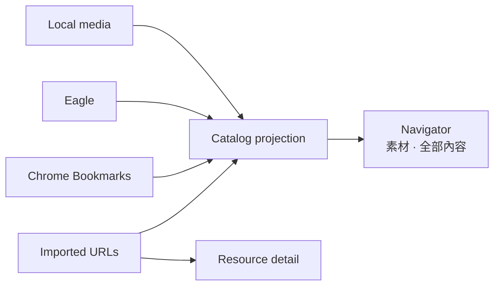

# Flowinone — multi-source resource renderer

Flowinone is a local-first renderer for visual media, bookmarks, and imported web resources. Its Navigator lets you browse or search across Local files, Eagle, Chrome Bookmarks, and Resources without moving the authoritative source into a new system.



## What it does

- **Navigator · 素材** (`/navigator/?scope=gallery`) — flat Local/Eagle/Bookmark browsing with source multi-select, filters, stable random order, scroll restoration, favorites, and bounded sessions.
- **Navigator · 全部內容** (`/navigator/?scope=all`) — SQLite FTS across Local, Eagle, Bookmarks, and Resources, with source/type/tag facets, tag ANY/ALL, and keyset pagination.
- **Resources** — import URLs or Chrome bookmarks; render metadata, thumbnail, summary, extracted article/PDF/transcript text, tags, and related resources.
- **Source-specific pages** — retain Eagle folders/tags/smart folders, Chrome bookmark tree, local folder views, image/video viewers, and maintenance tools.
- **Local sidecars** — portable `.flowinone.json` metadata import/export/audit for local media.

`/gallery/` and `/search/` are compatibility redirects only. They preserve query parameters and redirect to the Navigator's **素材** and **全部內容** scopes respectively; they are not separate user-facing surfaces.

Navigator uses one scope-aware page search instead of duplicating a global search field. From Resources or any other non-Navigator page, the navigation search opens Navigator in **全部內容** (`scope=all`).

Flowinone is deliberately **not** a knowledge-workflow application. BUILD, THINK, LEARN, SCAN, RECOVER, WRITE, Entries, Projects, Collections, Notes, and Obsidian export are not part of the running app.

文件入口：

- [現況架構](docs/architecture.md) — runtime、模組、資料權威、資料流與 routes。
- [使用手冊](docs/renderer-architecture.md) — 安裝、啟動、日常流程、同步與故障排除。
- [架構與 UI 修正計畫](docs/migration-plan.md) — 稽核問題、優先級、驗收標準與分階段計畫。
- [資料 schema](docs/schema.md) 與 [操作流程](docs/workflows.md) — 專題參考。

## Start

Use the existing Conda environment:

```bash
conda activate py3.11
python -m pip install -r requirements.txt
flask --app run resources-db-upgrade
flask --app run flowinone-doctor
python run.py
```

Visit `http://localhost:5894`; `/` redirects to the Navigator's **素材** scope at `/navigator/?scope=gallery`.

> Safety boundary: Flowinone enforces loopback hosts, same-origin writes, form
> CSRF, media-root containment, and a `127.0.0.1` bind. It still has no
> multi-user authentication, so do not expose it through a LAN, proxy, or tunnel.

Run background enrichment and bookmark-thumbnail processing in a second terminal:

```bash
conda run -n py3.11 python -m src.flowinone.workers
```

The Flask application factory never starts workers. This keeps Werkzeug reloads
and multi-process WSGI servers from creating duplicate worker sets. The web app
remains browsable without the worker process, but queued thumbnails, Resource
enrichment, and UI-triggered Catalog sync wait until it is running.

For headless setup, set valid Local media roots in `config.json` and use `FLOWINONE_HEADLESS=1`. `CHROME_BOOKMARK_PATH` defaults to the platform Chrome profile path and may be overridden in app configuration.

## Typical use

1. Open **Navigator · 素材** to browse Local, Eagle, and Bookmarks visually.
2. Switch to **全部內容** in the same Navigator when you do not know which source contains the item or want to include Resources.
3. Use Navigator's page search to keep its current scope; navigation search from another page opens **全部內容**.
4. Open **Resources** for imported URLs and their extracted full text.
5. Add user tags when they make future search better.
6. Sync a source after a large change.

## Maintenance

```bash
conda run -n py3.11 flask --app run resources-db-upgrade
conda run -n py3.11 flask --app run flowinone-doctor
conda run -n py3.11 flask --app run catalog-sync --source all
conda run -n py3.11 flask --app run catalog-sync --source eagle --full-rescan
conda run -n py3.11 flask --app run resources-worker --limit 20
conda run -n py3.11 flask --app run resources-rebuild-fts
conda run -n py3.11 flask --app run catalog-relations-rebuild
conda run -n py3.11 flask --app run sidecars-audit
conda run -n py3.11 flask --app run sidecars-export
conda run -n py3.11 flask --app run sidecars-import
```

Catalog sync uses resumable incremental Eagle batches by default. Use
`--full-rescan` when the saved checkpoint or projection needs to be rebuilt.

`resources-worker` performs metadata, thumbnail, content extraction, and optional AI-summary work. It never writes notes or exports to Obsidian.

## Architecture

- `run.py` — `create_app()` application factory and development-server entry point.
- `routes.py` — compatibility registration entry point only.
- `src/flowinone/web/` — namespaced Local, Chrome, Eagle, and media Blueprints,
  shared Pydantic API contracts, and response validation.
- `src/flowinone/workers.py` — dedicated background-worker process runtime.
- `src/flowinone/gallery/` — retained Gallery read model/API, design lab, and `/gallery/` compatibility redirect.
- `src/flowinone/catalog/` — Navigator HTTP surface plus the rebuildable cross-source Catalog, FTS, facets, cursors, events, sessions, and explainable item relations; it also owns the `/search/` compatibility redirect.
- `src/flowinone/resource_library/` — imported URL database, extraction jobs, Resource UI/API, and optional AI metadata.
- `src/file_handler/` — filesystem, Chrome, Eagle adapters, thumbnails, item DB, and sidecars.
- `migrations/` — Alembic history. `0007_renderer_only_cleanup` and `0008_renderer_resource_schema` remove the former knowledge-workflow tables, fields, and personal-note FTS data.

## Boundaries

Not planned here: cross-device sync, Raw → Wiki, Obsidian integration, OneTab/Keep/Notion/social connectors, autoplay/infinite feeds, Graph DB, agent swarm, or a full React/FastAPI rewrite.

Before upgrading an existing installation, back up `data/flowinone.sqlite3`. Migrations `0007_renderer_only_cleanup` and `0008_renderer_resource_schema` are intentionally destructive for former workflow, curation, and personal-note records.

## License

Distributed under the [MIT License](LICENSE).
