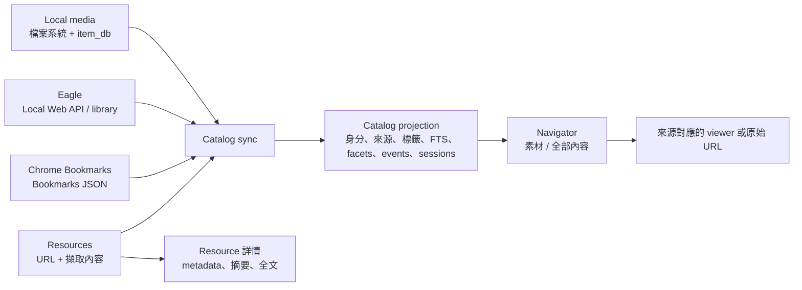
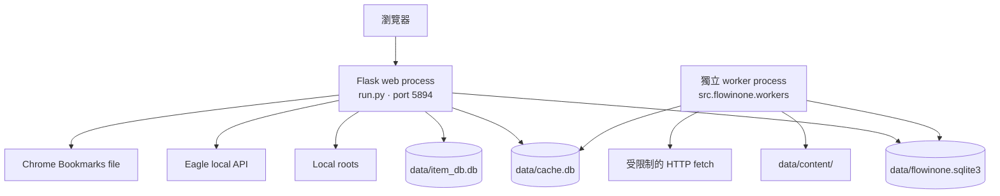
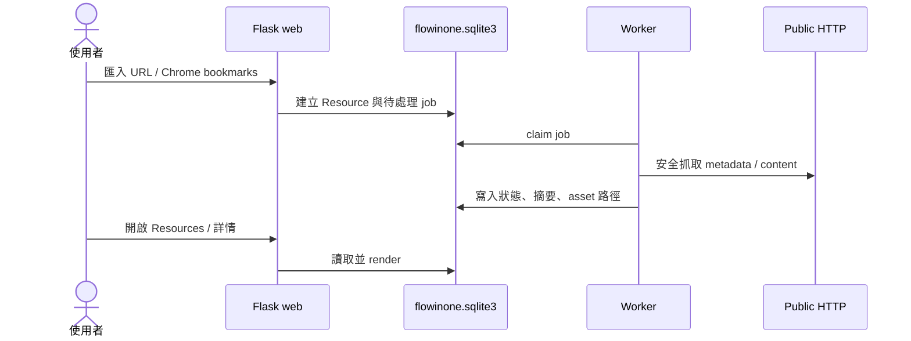

# Flowinone 現況架構

> 文件角色：這是執行中系統架構的權威說明。最後核對日期：2026-07-24。
> 問題、優先級與改造順序另見 [架構與 UI 修正計畫](migration-plan.md)，實際操作見 [使用手冊](renderer-architecture.md)。

## 1. 產品邊界

Flowinone 是一個 local-first、多來源的「資源瀏覽與搜尋器」。它不搬移來源資料，而是把 Local、Eagle、Chrome Bookmarks 與自行匯入的網址投影到同一份 Catalog，再由 Navigator 顯示。

它不是筆記、任務、專案或 Obsidian 工作流系統；舊版 BUILD、THINK、LEARN、SCAN、RECOVER、WRITE、Entry、Project、Collection 與 Note 已不在執行中產品範圍。

## 2. 執行時拓撲

系統實際上至少有兩個程序；只啟動 Flask 並不等於所有功能都在運作。

- `run.py` 建立 Flask app，預設只 bind `127.0.0.1:5894`，debug 與 dev tools 預設關閉。
- `python -m src.flowinone.workers` 處理 bookmark thumbnail、Resource enrichment 與排程的 Catalog sync。Web process 不會自動啟動它。
- Web Catalog sync 只 enqueue 持久化 leased job 並回 202；job、source sync state 與 worker heartbeat 都在主 SQLite 可追蹤。CLI `catalog-sync` 則是明確的同步 maintenance command。
- Eagle 必須正在執行且 local API 可連線，Eagle 頁面與同步才會完整可用。

## 3. 模組責任

| 位置 | 現行責任 | 備註 |
| --- | --- | --- |
| `run.py` | Flask application factory、顯式 startup validation、loopback 開發伺服器 | debug/dev tools 只在顯式 config 啟用 |
| `routes.py` | 註冊 Blueprint、request security 與 `flowinone-doctor` | `/debug/` 只在 dev tools 模式註冊 |
| `src/flowinone/web/` | Local、Chrome、Eagle、media HTTP adapters 與 API schema | 包含來源專屬頁面及檔案回應 |
| `src/flowinone/catalog/` | Navigator、Catalog query/sync、FTS、facets、sessions、events、relations | `service.py` 同時承擔查詢、同步與 adapter orchestration，責任過多 |
| `src/flowinone/resource_library/` | URL CRUD、import、metadata/content extraction、job、Resource UI/API | 與 Catalog 共用主 SQLite |
| `src/flowinone/gallery/` | 舊 Gallery compatibility API、dev-only design lab、相容 redirect | 使用者主頁只走 Navigator；compatibility read model 待刪 |
| `src/file_handler/` | Local/Eagle/Chrome 來源 adapter、item index、sidecar、thumbnail store/worker | item/cache path 已改由絕對 `FLOWINONE_DATA_DIR` 派生 |
| `src/eagle_api/` | Eagle API client | Eagle 是權威來源，更新應走其 local API |
| `migrations/` | `flowinone.sqlite3` 的 Alembic schema history | `0007`、`0008` 對舊 workflow 資料具有破壞性 |
| `templates/`、`static/` | Server-rendered Jinja UI 與 vanilla CSS/JS | 不是 SPA，filter 多以整頁 navigation 更新 |

## 4. 資料權威與儲存層

| 資料 | 權威來源 | Flowinone 中的角色 | 可否重建 |
| --- | --- | --- | --- |
| Local media | 原始檔案系統 | `item_db.db` 索引；`.flowinone.json` sidecar 保存可攜 metadata | item index 可重建；sidecar 不應任意丟棄 |
| Eagle items | Eagle library / local API | Catalog origin 與來源專屬 view | Catalog 可重建，不應直接改 Eagle `.info/metadata.json` |
| Chrome bookmarks | Chrome `Bookmarks` JSON | Catalog origin、bookmark thumbnail job | Catalog/thumbnail 可重建 |
| Resources | `flowinone.sqlite3` + `data/content/` | Flowinone 自有 URL、metadata、標籤、擷取內容 | 原始 URL 可重抓，但使用者標籤與狀態需備份 |
| Catalog | `flowinone.sqlite3` | 多來源的可重建 projection | 可由四個來源重建 |

目前有三套 SQLite 管理方式：

1. `data/flowinone.sqlite3`：SQLAlchemy + Alembic，容納 Resource 與 Catalog。
2. `data/item_db.db`：raw `sqlite3`，Local media index，程式內就地補 schema。
3. `data/cache.db`：raw `sqlite3`，thumbnail/job/cache，程式內就地補 schema。

三者現在都從絕對 `FLOWINONE_DATA_DIR` 派生（並可用各自 env override），不再因 process current working directory 而產生另一組 DB。不過 item/cache DB 仍是 runtime 內自管 schema，尚未與 Alembic lifecycle 統一。

## 5. 主要資料流程

### 5.1 Navigator / Catalog

1. `CatalogSyncService` 從 Local、Eagle、Bookmarks、Resources 讀取來源資料。
2. 將來源記錄正規化成 item 與 origin；同 URL 的 Bookmark/Resource 可指向同一 canonical item，但保留各自 origin。
3. 建立 FTS、facets、tag、user state、event、session 與 relation projection。
4. `/navigator/` 使用 `CatalogService` 查詢，依 scope 顯示：
   - `gallery`（素材）：Local、Eagle、Bookmarks。
   - `all`（全部內容）：上述三者加 Resources，並使用全文搜尋。
5. 使用者開卡片時依 origin 導向 Local/Eagle viewer 或原始 URL。

Catalog 是 projection，不應成為覆寫來源 metadata 的捷徑。Eagle metadata 先在 Eagle 透過 API 修改，再執行 Catalog sync；EAGLE資料處理 repo 的維護腳本也屬於這個上游流程。

### 5.2 Resource enrichment

HTTP fetch 層已有 public-IP 驗證、redirect 重新驗證、回應大小與 redirect 次數上限；worker 未啟動時，job 只會留在 pending。

## 6. 使用者介面與 routes

| Surface | Route | 用途 |
| --- | --- | --- |
| 首頁 | `/` | redirect 至 `/navigator/?scope=gallery` |
| Navigator · 素材 | `/navigator/?scope=gallery` | Local、Eagle、Bookmarks 的視覺瀏覽 |
| Navigator · 全部內容 | `/navigator/?scope=all` | 四來源搜尋、facets、收藏與分頁 |
| Resources | `/resources/` | 匯入與管理網址、查看 enrichment 狀態 |
| 來源總覽 | `/library/` | 顯示來源狀態與入口 |
| Eagle | `/EAGLE_folders/`、`/EAGLE_tags/`、`/EAGLE_smart_folders/`、`/EAGLE_stream/` | Eagle 專屬瀏覽 |
| Chrome | `/chrome/` | 書籤 tree 瀏覽 |
| Local | `/folders/`、`/item_db`、`/grid/...`、`/slide/...` | 資料夾、index 與 viewer |
| 相容入口 | `/gallery/`、`/search/` | 分別 redirect 到 Navigator 的 `gallery`、`all` scope |
| 開發頁 | `/gallery/lab`、`/debug/` | 僅 `FLOWINONE_DEV_TOOLS` 啟用時可用 |

Navigator 只顯示頁內的 scope-aware 搜尋，避免與全域搜尋重複；其他頁面的導覽列搜尋預設 `scope=all`。

## 7. 啟動、設定與 migration 的實際行為

- import `config.py` 只讀取設定，不會開 Tkinter 或寫檔。交互式 root setup 只在明確建立 non-testing app 時執行。
- `FLOWINONE_HEADLESS=1` 在路徑缺失時 fail fast；也可用 `FLOWINONE_DB_ROUTE_EXTERNAL/INTERNAL` override。
- production runtime 不自動執行 Alembic DDL；schema 不是 head 時會拒絕開啟 DB 並給出 upgrade 指令。
- `resources-db-upgrade` 先建立 timestamped SQLite backup，來源與備份皆通過 `PRAGMA integrity_check` 後才 upgrade。
- 舊資料庫升級時要使用 `resources-db-upgrade`；它會自動備份 `flowinone.sqlite3`。`0007_renderer_only_cleanup` 與 `0008_renderer_resource_schema` 會刪除舊 workflow/curation/personal-note 資料，仍應先確認備份位置。
- config 讀取與 migration 現已分離；`flowinone-doctor` 可在啟動 web 前檢查 roots 與 schema revision。

## 8. 可靠性與安全邊界

本機 request boundary 現在包含 loopback Host allowlist、unsafe method Origin gate、HTML form CSRF token，media path 也必須位於 allowlist roots 並符合圖片 extension。系統仍沒有多使用者認證與授權，所以運行時仍應只供 loopback 本機使用，不要透過 reverse proxy、tunnel 或 LAN 暴露。

## 9. 專案間邊界

`Flowinone` 與相鄰的 `EAGLE資料處理` 是兩個不同責任的 repo：

- `EAGLE資料處理`：掃描、判斷及批次修正 Eagle metadata；寫入應使用 Eagle local API、保留 audit JSONL，並以 API 驗證結果。
- `Flowinone`：讀取 Eagle 並建立 Catalog projection，供瀏覽與搜尋；不應複製一套 Eagle metadata 寫入邏輯。

因此完整鏈路是「Eagle API 更新 → Eagle API 驗證 → Flowinone 執行 Eagle Catalog sync → Navigator 看見新 projection」。
