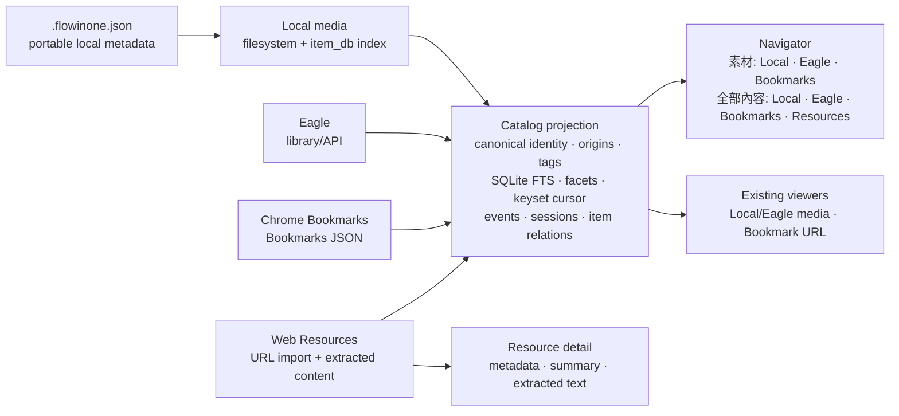

# Flowinone renderer architecture

Flowinone is now a local-first **resource renderer**. It does not own a knowledge workflow, notes, projects, or an Obsidian bridge. Its job is to make resources from several sources easy to browse, open, search, and inspect through one Navigator.

## Authority and projection

Each source stays authoritative:

- Local media: original filesystem; `item_db` is an index.
- Eagle: Eagle library/API.
- Bookmarks: Chrome Bookmarks JSON.
- Web Resources: Flowinone SQLite database plus extracted-content files.

Catalog is a rebuildable projection, never the source of truth. It merges same-URL Bookmark and Resource records for Navigator retrieval while preserving each origin, so opening a result still uses the correct source behavior.

## Main surfaces

| Surface | Purpose | Source scope |
| --- | --- | --- |
| `/navigator/` or `/navigator/?scope=gallery` (**素材**) | Browse and filter flat image, video, and bookmark cards | Local, Eagle, Bookmarks |
| `/navigator/?scope=all` (**全部內容**) | FTS search, browse, and facets across every indexed source | Local, Eagle, Bookmarks, Resources |
| `/resources/` | Browse imported web resources | Resources |
| Existing source pages | Folder/tree maintenance and source-specific browsing | Local, Eagle, Chrome |

## Global search scope

The global navigation search always submits to `/navigator/`. On a Navigator page, its hidden `scope` value follows the active **素材** or **全部內容** scope. On a non-Navigator page, it sends `scope=all`, ensuring that “搜尋素材與資源” searches Local, Eagle, Bookmarks, and Resources.

`/gallery/` and `/search/` are compatibility redirects only. They preserve query parameters and redirect to `/navigator/` with `scope=gallery` and `scope=all` respectively; neither is a separate application surface.

## Intentional boundary

There are no BUILD, THINK, LEARN, SCAN, RECOVER, WRITE, Entry, Project, Collection, Draft Note, or Obsidian routes in the running app. Existing source folders remain source metadata or source-specific views; they are not Navigator cards themselves.

## Web and worker runtime

`run.create_app()` constructs only the Flask web application. Local, Chrome,
Eagle, and local-media HTTP adapters are separate namespaced Blueprints under
`src/flowinone/web/`; `routes.py` remains a small compatibility registrar.

Every JSON `/api/*` handler validates request bodies or query parameters and
validates its public response with Pydantic contracts before serialization.
Binary thumbnail responses validate their path identifier and then use Flask's
conditional file response.

Long-running thumbnail and Resource enrichment workers are owned by the separate
`python -m src.flowinone.workers` process. They are never started by the
application factory or Werkzeug debug server. The worker runtime stops as a unit
if either worker exits; the thumbnail worker's SQLite runtime lease prevents a
second worker runtime from remaining active.
