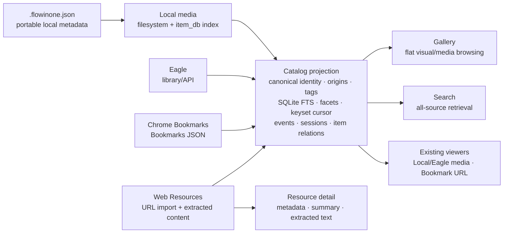

# Flowinone renderer architecture

Flowinone is now a local-first **resource renderer**. It does not own a knowledge workflow, notes, projects, or an Obsidian bridge. Its job is to make resources from several sources easy to browse, open, search, and inspect.

## Authority and projection

Each source stays authoritative:

- Local media: original filesystem; `item_db` is an index.
- Eagle: Eagle library/API.
- Bookmarks: Chrome Bookmarks JSON.
- Web Resources: Flowinone SQLite database plus extracted-content files.

Catalog is a rebuildable projection, never the source of truth. It merges same-URL Bookmark and Resource records for search while preserving each origin, so opening a result still uses the correct source behavior.

## Main surfaces

| Surface | Purpose | Source scope |
| --- | --- | --- |
| `/gallery/` | Browse flat image, video, and bookmark cards | Local, Eagle, Bookmarks |
| `/search/` | FTS search and facets | Local, Eagle, Bookmarks, Resources |
| `/resources/` | Browse imported web resources | Resources |
| Existing source pages | Folder/tree maintenance and source-specific browsing | Local, Eagle, Chrome |

## Intentional boundary

There are no BUILD, THINK, LEARN, SCAN, RECOVER, WRITE, Entry, Project, Collection, Draft Note, or Obsidian routes in the running app. Existing source folders remain source metadata or source-specific views; they are not Gallery cards themselves.
