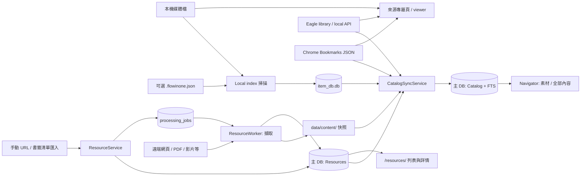
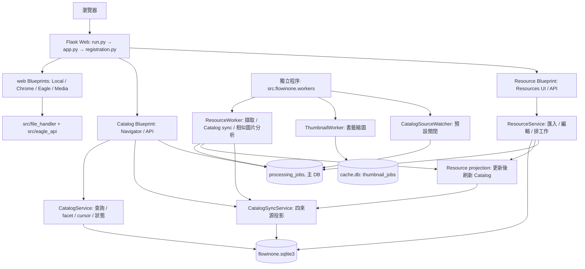
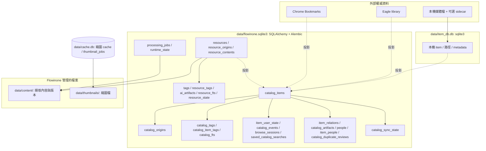

# Flowinone 現行架構

> 依 `5b530b0`（2026-09-28）的程式碼核對。這裡描述目前可執行的系統；安裝、操作與維護指令見 [使用手冊](renderer-architecture.md)，實際追碼練習見 [動手接手](hands-on.md)。

## 先記住的模型

Flowinone 有 **四種進入 Catalog 的來源**。原始資料各有權威位置；`Catalog` 是供跨來源瀏覽、篩選與搜尋的投影，不是來源備份。`Gallery`／「素材」只是 Navigator 的查詢範圍，不是另一套資料庫或服務。

| Catalog `source_kind` | 權威資料 | 進入 Catalog 的路徑 |
| --- | --- | --- |
| `local` | `config.json` 指定的本機圖片、影片；可選 `.flowinone.json` metadata | 掃描檔案 → `item_db.db` → Local Catalog sync |
| `eagle` | Eagle library，透過執行中的 Eagle local API 讀取 | Eagle adapter 分頁／增量同步 |
| `bookmarks` | Chrome Default profile 的 `Bookmarks` JSON | Chrome parser → Catalog sync；不安全或非網頁 URL 會略過 |
| `resources` | Flowinone 自己的 `resources` 等資料表與 `data/content/` | 加入 URL 或匯入書籤建立 Resource → 同步該 Resource 到 Catalog |

四種來源由 [Catalog query](../src/flowinone/catalog/query.py) 的 `CATALOG_SOURCES` 定義。手動 URL、Chrome／JSON／HTML 書籤清單是 **Resource 的匯入方式**；遠端網頁、PDF、YouTube 字幕、GitHub 內容和可選 AI 摘要是 **Resource 的擷取內容**。它們都不會各自變成第五種 Catalog 來源。

## 1. 完整資料流

```mermaid
flowchart LR
  Files["本機媒體檔"] --> Scan["Local index 掃描"]
  Sidecar["可選 .flowinone.json"] --> Scan
  Scan --> ItemDB[("item_db.db")]

  ItemDB --> Sync["CatalogSyncService"]
  Eagle["Eagle library / local API"] --> Sync
  Chrome["Chrome Bookmarks JSON"] --> Sync

  Import["手動 URL / 書籤清單匯入"] --> ResourceService["ResourceService"]
  ResourceService --> ResourceDB[("主 DB: Resources")]
  ResourceService --> Jobs[("processing_jobs")]
  Jobs --> Enrich["ResourceWorker: 擷取"]
  Web["遠端網頁 / PDF / 影片等"] --> Enrich
  Enrich --> Content["data/content/ 快照"]
  Enrich --> ResourceDB
  ResourceDB --> Sync
  Content --> Sync

  Sync --> Catalog[("主 DB: Catalog + FTS")]
  Catalog --> Navigator["Navigator: 素材 / 全部內容"]
  ResourceDB --> ResourcePages["/resources/ 列表與詳情"]

  Files --> SourcePages["來源專屬頁 / viewer"]
  Eagle --> SourcePages
  Chrome --> SourcePages
```

- **Local 有兩層索引**：一般的 Catalog sync 只讀既有 `item_db.db`，不重掃磁碟。新增媒體後先在 `/item_db` 更新本機索引，再同步 Catalog。啟用來源變動偵測後，由它排入的 Local job 可要求先刷新本機索引。
- **Resource 有自己的資料與頁面**：`/resources/` 讀 Resource；`/navigator/?scope=all` 讀 Catalog 投影。Resource 建立、標籤或擷取內容更新並提交後，透過 `resource_library/projection.py` 刷新對應投影。擷取工作的 worker 未運行時，工作仍在 queue 等待。
- **同一 URL 可有多個來源**：Bookmark 與 Resource 經 URL canonicalization 後可共用一筆 `catalog_items`，`catalog_origins` 仍保留兩個來源紀錄。
- **直接來源頁和 Navigator 讀法不同**：`/folders/`、`/chrome/`、`/EAGLE_*` 保留來源的資料夾或樹狀結構；Navigator 讀統一 Catalog。來源同步與來源頁讀取不是同一件事。
- `gallery` scope 只包含 Local、Eagle、Bookmarks；`all` scope 再加 Resources。瀏覽入口是 `/navigator/`，舊 `/gallery/`、`/search/` 與 Gallery API 已移除。

## 2. 程式架構：請求與背景工作

```mermaid
flowchart TB
  Browser["瀏覽器"] --> Flask["Flask Web: run.py → app.py → registration.py"]
  Flask --> SourceBP["web Blueprints: Local / Chrome / Eagle / Media"]
  Flask --> CatalogBP["Catalog Blueprint: Navigator / API"]
  Flask --> ResourceBP["Resource Blueprint: Resources UI / API"]

  SourceBP --> Adapters["src/file_handler + src/eagle_api"]
  CatalogBP --> CatalogService["CatalogService: 查詢 / facet / cursor / 狀態"]
  CatalogBP --> SyncService["CatalogSyncService: 四來源投影"]
  ResourceBP --> ResourceService["ResourceService: 匯入 / 編輯 / 排工作"]
  CatalogService --> MainDB[("flowinone.sqlite3")]
  SyncService --> MainDB
  ResourceService --> MainDB
  ResourceService --> Projection["Resource projection: 更新後刷新 Catalog"]
  Projection --> SyncService
  ResourceService --> JobQueue[("processing_jobs, 主 DB")]
  CatalogBP --> JobQueue

  Runtime["獨立程序: src.flowinone.workers"] --> ResourceWorker["ResourceWorker: 擷取 / Catalog sync / 相似圖片分析"]
  Runtime --> ThumbnailWorker["ThumbnailWorker: 書籤縮圖"]
  Runtime --> Watcher["CatalogSourceWatcher: 預設關閉"]
  ResourceWorker --> JobQueue
  ResourceWorker --> Projection
  ResourceWorker --> SyncService
  ThumbnailWorker --> CacheDB[("cache.db: thumbnail_jobs")]
  Watcher --> JobQueue
```

`run.py` 是啟動入口；`src/flowinone/app.py` 建立 Flask app，`src/flowinone/web/registration.py` 註冊 Blueprint、安全檢查與 CLI。根目錄的 `config.py`、`routes.py` 保留舊匯入相容性，實作位於 `src`。HTTP route 負責接收請求、回傳 Jinja HTML／JSON，或把耗時工作寫入持久化 queue。另一個程序 `python -m src.flowinone.workers` 執行 `ResourceWorker`、`ThumbnailWorker` 與來源 watcher。`ResourceWorker` 的名字較窄，實際還處理 Catalog sync 和本機圖片分析。Web 不會自行啟動 worker；只開 Web 可讀既有資料，排隊工作則不會完成。

Navigator 的「同步變更」會建立 `processing_jobs` 工作並回 202；CLI `catalog-sync` 則直接執行同步。開啟自動偵測後，watcher 先建立來源基準，再對穩定變化排 job。書籤縮圖另用 `cache.db` 中的 `thumbnail_jobs`，由 `ThumbnailWorker` 處理，不要與主 DB 的 `processing_jobs` 混為一談。

| 程式位置 | 主要責任 |
| --- | --- |
| [src/flowinone/app.py](../src/flowinone/app.py)、[src/flowinone/web/registration.py](../src/flowinone/web/registration.py)、[src/flowinone/config.py](../src/flowinone/config.py) | app factory、啟動檢查、路由與 CLI 註冊、設定讀寫；根目錄只留入口與相容匯入 |
| [src/flowinone/web/](../src/flowinone/web/) | Local／Chrome／Eagle／media 的 HTTP 頁面與 API |
| [src/flowinone/catalog/](../src/flowinone/catalog/) | Catalog 投影、Navigator 查詢、同步、事件、搜尋、關聯 |
| [src/flowinone/resource_library/](../src/flowinone/resource_library/) | Resource 匯入、資料庫存取、擷取、工作佇列與 UI |
| [src/file_handler/](../src/file_handler/)、[src/eagle_api/](../src/eagle_api/) | 本機索引、sidecar、Chrome parser、縮圖與 Eagle client |
| [src/flowinone/workers.py](../src/flowinone/workers.py) | 背景程序與 worker／watcher 的生命週期 |
| [scripts/](../scripts/) | 維護指令與 macOS 啟停入口；應用程式邏輯由 `src/` 提供 |
| [templates/](../templates/)、[static/](../static/) | Jinja 畫面與 CSS／原生 JavaScript |
| [migrations/](../migrations/) | 主 SQLite 的 Alembic schema 版本 |

Catalog 與 Resource Library 各自以 `blueprint.py` 放頁面與註冊、`api.py` 放 JSON route、`commands.py` 放 CLI；`http.py` 提供共用 Blueprint 和 request helper。兩者共用的資料庫設定在 `web/database.py`。

## 3. 資料架構：權威、投影與儲存位置

```mermaid
flowchart TB
  subgraph Upstream["外部權威資料"]
    Files["本機媒體檔 + 可選 sidecar"]
    Eagle["Eagle library"]
    Chrome["Chrome Bookmarks"]
  end

  subgraph Item["data/item_db.db: sqlite3"]
    LocalItems["本機 item / 路徑 / metadata"]
  end

  subgraph Main["data/flowinone.sqlite3: SQLAlchemy + Alembic"]
    Resources["resources / resource_origins / resource_contents"]
    ResourceMeta["tags / resource_tags / ai_artifacts / resource_fts / resource_state"]
    Jobs["processing_jobs / runtime_state"]
    CatalogItems["catalog_items"]
    Origins["catalog_origins"]
    CatalogTags["catalog_tags / catalog_item_tags / catalog_fts"]
    Browse["item_user_state / catalog_events / browse_sessions / saved_catalog_searches"]
    Discovery["item_relations / catalog_artifacts / people / item_people / catalog_duplicate_reviews"]
    SyncState["catalog_sync_state"]
  end

  subgraph Filesystem["Flowinone 管理的檔案"]
    Content["data/content/: 擷取內容與版本"]
    Thumbnails["data/thumbnails/: 縮圖檔"]
  end

  Cache[("data/cache.db: 縮圖 cache / thumbnail_jobs")]

  Files --> LocalItems
  LocalItems -. "投影" .-> CatalogItems
  Eagle -. "投影" .-> CatalogItems
  Chrome -. "投影" .-> CatalogItems
  Resources --> ResourceMeta
  Resources --> Content
  Resources -. "投影" .-> CatalogItems
  Jobs --> Content
  CatalogItems --> Origins
  CatalogItems --> CatalogTags
  CatalogItems --> Browse
  CatalogItems --> Discovery
  CatalogItems --> SyncState
  Cache --> Thumbnails
```

| 位置 | 是否為可重建 cache | 保存時的重點 |
| --- | --- | --- |
| 本機媒體、sidecar、Eagle library、Chrome Bookmarks | 否，都是上游資料 | Catalog 同步不是來源備份；sidecar 的自訂 metadata 要跟素材一起保留 |
| `data/item_db.db` | 檔案索引可重掃 | 若 metadata 只在 index、未匯出 sidecar，仍要先保留 |
| `data/flowinone.sqlite3` | **不能整庫當 cache 刪** | Catalog 投影可重建；Resources、使用者標籤、收藏、儲存搜尋、工作狀態等需備份 |
| `data/content/` | 歷史版本無法保證重抓 | `resource_contents` 保存檔案路徑，兩者需一起保留 |
| `data/cache.db`、`data/thumbnails/` | 縮圖通常可重建 | 刪除會失去現有 cache／縮圖 job 狀態 |

預設路徑在 repo 的 `data/`；`FLOWINONE_DATA_DIR` 可改共用根目錄，部分 DB 可各自覆寫路徑。主 DB 用 SQLAlchemy／Alembic；本機索引與縮圖 cache 各用 Python `sqlite3` 管理。`resource_contents` 只記錄內容檔路徑；Catalog sync 會讀最新擷取文字，放入 `catalog_fts` 供跨來源搜尋。

歷史 migration 仍留在 repo 供舊庫升級，但 `0007`、`0008` 已移除 Entries／Projects／Collections／Notes 等舊工作流或欄位。它們不是目前的資料流。`/debug/` 只在 `FLOWINONE_DEV_TOOLS` 啟用時註冊，舊 Gallery Lab 已移除。

## 4. 從畫面追到程式：建議讀法

1. 先看 [README](../README.md) 的「先接回你熟悉的 Flask」和四來源摘要，掌握 request → service → DB／adapter → template。
2. 用本頁的「完整資料流」分清 **來源、索引、投影**；再看程式架構圖分清 **Web 與 Worker**；最後看資料架構圖確認 **資料實際保存位置**。
3. 想追搜尋：`templates/navigator.html` → `catalog/blueprint.py` 的 `_navigator_query()`／`navigator_page()` → `catalog/query.py` 的 `CatalogQuery` → `catalog/browse.py` 的 `CatalogService.list()`。
4. 想追本機新檔：`web/local.py` 的 `/update_db` → `file_handler/item_db.py` 的 `update_item_database()` → `catalog/sync.py` 的 `_sync_local()`。
5. 想追匯入與擷取：`resource_library/blueprint.py`／`api.py` → `service.py`／`repository.py` → `jobs.py` → `worker.py` → `enrichment.py`／`extractors.py`。
6. 想驗證每一段，接著做 [動手接手練習](hands-on.md)。實際啟動、同步與故障排除查 [使用手冊](renderer-architecture.md)。
