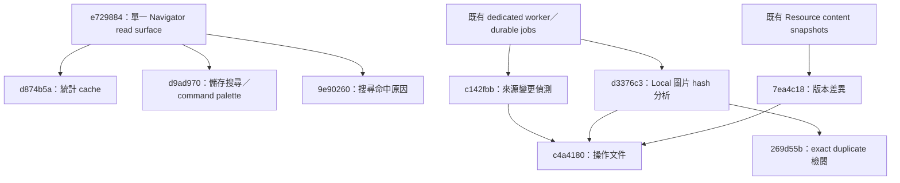

# Commit 改動紀錄

這份文件記錄 `dev_a` 相對於當時 `origin/dev_a` 基準 `8b1f48b` 的 9 筆 commit，
範圍為 `8b1f48b..269d55b`。內容依 commit 時間由舊到新排列，命令皆從專案根目錄執行，
Python／pytest 一律使用既有 Conda 環境 `py3.11`。

## 這份文件要幫你做到什麼

目標不是保存 diff 流水帳，而是讓你快速取得四種答案：

1. **Catch up**：3 分鐘內知道最近改了什麼，以及哪些改動彼此依賴。
2. **能測試**：找到最小且可重跑的測試，不必先讀完整份 diff。
3. **找因果**：看見「原本問題 → 採取改動 → 可觀察結果」，失敗時知道先查哪一層。
4. **有掌控感**：動手前知道會改哪些 state、如何停止、如何重跑，以及 rollback 會失去什麼。

建議閱讀順序：先看下方快速總覽；要驗證時使用測試控制台；測試失敗或需要接手維護時，
再跳到對應 commit 的詳細章節。

## 3 分鐘 Catch-up

| Commit | 因：原本問題 | 果：現在應看到 | 最快證明 | 掌控點 |
| --- | --- | --- | --- | --- |
| [`e729884`](#commit-e729884) | Gallery 與 Catalog 有兩套 read model | Navigator 成為唯一跨來源瀏覽面 | `test_navigator_compatibility.py` | 舊 `/api/gallery/*` 已移除；redirect 可觀察、無資料 migration |
| [`d874b5a`](#commit-d874b5a) | 翻頁會重算 total／facets | 相同 filter 重用統計，資料更新後失效 | `-k browse_metadata_cache` | cache 是可丟棄衍生資料；錯誤時先查 invalidation |
| [`d9ad970`](#commit-d9ad970) | 常用 filter 無法命名重用 | 可儲存搜尋並用 `⌘/Ctrl K` 開啟 | `-k saved_searches` | migration `0011`；刪除只影響 saved search |
| [`9e90260`](#commit-9e90260) | 搜尋結果不知道為何命中 | 卡片與 API 顯示命中欄位／摘錄 | `-k catalog_merges_origins` | 唯讀呈現；先查 FTS 欄位與 `match_reason` |
| [`c142fbb`](#commit-c142fbb) | 來源變更後要手動同步 | watcher 去抖後排 durable sync job | `test_catalog_source_watch.py` | 預設關閉；worker 停止就不再觀測或執行 queue |
| [`d3376c3`](#commit-d3376c3) | 不知道 Local 圖片是否重複／相似 | SHA-256 exact 與 dHash visual results | `test_catalog_similarity.py` | 只讀來源檔，只寫 DB artifacts；需要 worker |
| [`7ea4c18`](#commit-7ea4c18) | Resource 重新擷取後難以知道改了什麼 | 可比較保存的文字 snapshots | `-k content_version` | compare 唯讀；重新擷取才會產生新 snapshot |
| [`c4a4180`](#commit-c4a4180) | 新流程缺少操作說明 | README／workflows 與功能一致 | `git show --check c4a4180` | 無 runtime state；風險是文件漂移 |
| [`269d55b`](#commit-269d55b) | exact duplicates 缺少全庫檢閱入口 | 可分組檢閱並選參考圖片 | `test_catalog_similarity.py` | migration `0012`；不刪、不移、不修改來源圖片 |

## 因果與依賴圖



這張圖表達的是功能因果，不只是 commit 時間順序。例如 duplicate review 找不到群組時，
應先確認 `d3376c3` 的圖片分析是否完成，而不是先查 `269d55b` 的頁面 CSS。

## 測試控制台

### 我只想快速知道這批改動有沒有壞

```bash
conda run -n py3.11 pytest -q \
  tests/test_navigator_compatibility.py \
  tests/test_app_architecture.py \
  tests/test_catalog_next_phase.py \
  tests/test_catalog_source_watch.py \
  tests/test_catalog_similarity.py \
  tests/test_resource_enrichment.py
```

本文件整理時的結果是 `47 passed`。若這層失敗，先用上方表格找到對應 commit，再執行該章節的
最小測試，不必一開始就跑整個 test suite。

### 哪些動作會改 state

| 動作 | 會改什麼 | 如何保有控制 |
| --- | --- | --- |
| 執行上述 pytest | pytest 的 temporary database／files | 不改正式 Flowinone DB；可安全重跑 |
| `resources-db-upgrade` | 正式 DB schema 升到 `0011`／`0012` | 先備份 `data/flowinone.sqlite3`；downgrade 會失去 saved searches／review choices |
| `catalog-sync` | 可重建的 Catalog projection | 不搬動權威來源；失敗可重跑單一 source |
| 啟用 source watcher | `runtime_state`，並可能排 `catalog_sync` job | 預設關閉；UI 可暫停，停止 worker 可停止後續觀測／執行 |
| similarity rebuild | 讀取 Local 圖片，寫入 hash artifacts | 不修改圖片；停止 worker 後 pending job 不會前進 |
| Resource 重新擷取 | 下載／抽取內容並保存新 snapshot | version compare 本身唯讀；先確認目標 Resource |
| 選 duplicate 參考圖片 | `catalog_duplicate_reviews` 一筆 metadata | 可改選另一張；不刪除或修改來源檔 |

### 出問題時的最短排查順序

1. **頁面不存在／schema error**：先跑 `resources-db-upgrade`，再確認 route 所屬 commit。
2. **畫面可開但背景狀態不動**：確認 `python -m src.flowinone.workers` 是否正在執行。
3. **資料舊或筆數不對**：先查 sync status，再查 `d874b5a` cache invalidation。
4. **duplicate review 沒有群組**：先看 similarity status 是否已分析，而不是先動來源圖片。
5. **Resource 沒有可比較版本**：確認是否真的保存了兩個不同 content hash 的 snapshots。

## 建議每次 commit 記錄的欄位

欄位順序應配合「先建立因果，再取得證據，最後確認可回復性」：

1. **一句話因果**：因為什麼問題，所以改了什麼，預期造成什麼結果。
2. **最快證明**：最小測試 command、人工觀察位置與明確 pass condition。
3. **掌控點**：會改哪些 state、依賴哪個 process／外部來源，以及安全停止方式。
4. **失敗導航**：失敗時先看哪個 log、status、route、資料表或上游 commit。
5. **回復代價**：rollback 會失去哪些 metadata／schema／相容性；不要只寫 `git revert`。
6. **Commit 資訊與範圍**：hash、日期、issue／PR、受影響模組及明確未包含項目。

其中 1～3 是每筆都必填；其餘欄位若不適用，明確寫「無」會比直接省略更容易審查。

## 共用準備方式

安裝、升級資料庫並啟動 Web：

```bash
conda run -n py3.11 python -m pip install -r requirements.txt
conda run -n py3.11 flask --app run resources-db-upgrade
conda run -n py3.11 flask --app run flowinone-doctor
conda run -n py3.11 python run.py
```

需要背景工作時，在另一個 terminal 啟動：

```bash
conda run -n py3.11 python -m src.flowinone.workers
```

預設 Web 位址為 `http://127.0.0.1:5894`。

本文件涉及的主要自動測試已於 2026-08-09 使用 `py3.11` 實跑：`47 passed`；另有 5 筆
第三方 SWIG type 的 `DeprecationWarning`，沒有測試失敗。

---

<a id="commit-e729884"></a>

## `e729884` — refactor: remove Gallery compatibility read model

- 日期：2026-07-26
- 類型：重構／breaking API removal

### 背景與改動內容

- 移除重複的 `src/flowinone/gallery/` read model、service、Blueprint 與相關測試。
- 移除 `/api/gallery/*`、Gallery Lab 頁面及其 template、CSS、JavaScript。
- 將 `/gallery/` 與 `/search/` 集中到 Catalog Blueprint，保留為暫時相容 redirect。
- 相容 redirect 會保留原 query parameters、強制指定 Navigator scope，並回傳
  `Deprecation`／`Sunset` headers；預定於 2026-12-31 後移除。
- 文件與 API schema 改以 Navigator／Catalog 作為唯一跨來源瀏覽 read surface。

### 預期結果

- `/gallery/?source=local` 轉往 `/navigator/?source=local&scope=gallery`。
- `/search/?q=example` 轉往 `/navigator/?q=example&scope=all`。
- Navigator 正常瀏覽；舊 `/api/gallery/items` 不再存在，應回傳 404。
- runtime 不再載入 Gallery domain 或 Gallery Lab 靜態資源。

### 測試法／使用法

```bash
conda run -n py3.11 pytest -q \
  tests/test_navigator_compatibility.py \
  tests/test_app_architecture.py
```

啟動 Web 後人工確認：

```bash
curl -I 'http://127.0.0.1:5894/gallery/?source=local&q=example'
curl -I 'http://127.0.0.1:5894/search/?source=bookmarks&q=example'
curl -o /dev/null -s -w '%{http_code}\n' \
  'http://127.0.0.1:5894/api/gallery/items'
```

前兩個 request 應為 redirect，且包含 `Deprecation`、`Sunset` 與指向 Navigator 的
`Location`；最後一個應輸出 `404`。

### 影響、風險與回復注意事項

- 依賴 `/api/gallery/*` 的舊 client 會中斷，需改用 `/api/catalog/items`。
- 本 commit 沒有資料庫 migration。
- 若要回復，除了程式碼外還要恢復已刪除的 Gallery templates／靜態資源；不要讓
  Gallery 與 Catalog 同時成為權威 read model。

---

<a id="commit-d874b5a"></a>

## `d874b5a` — perf: cache navigator browse metadata

- 日期：2026-08-08
- 類型：效能

### 背景與改動內容

- 為 Navigator 的 exact total 與 facets 加入每個 database instance 共用的 128-entry LRU cache。
- cache key 包含實際 filter，但排除 cursor、limit、sort、random seed，讓同一篩選的翻頁或
  顯示排序可重用統計結果。
- 在 `runtime_state` 保存 Catalog browse revision，使 Web 與 worker 位於不同 process 時仍能失效舊 cache。
- Catalog sync、單筆 Resource sync、會改變 FTS 的 OCR，以及使用者狀態改動後會更新 revision。

### 預期結果

- 同一組 Navigator 篩選的第二次讀取與下一頁不再重跑 `COUNT(DISTINCT ...)` 和 facet `GROUP BY`。
- 不同 filter 不會錯用彼此的 total／facets。
- Catalog 資料更新後，下一次讀取會重新計算，畫面不會顯示過期筆數。
- 100k 測試資料的 warm browse 仍保留 keyset data query，並符合既有的效能門檻。

### 測試法／使用法

```bash
conda run -n py3.11 pytest -q tests/test_catalog_next_phase.py \
  -k 'browse_metadata_cache or 100k_keyset_query_contract'
```

人工測試可在 Navigator 套用固定 filter，連續重新整理並載入下一批；接著新增來源項目並執行：

```bash
conda run -n py3.11 flask --app run catalog-sync --source local
```

同步後回到相同頁面，總筆數與 facets 應反映新資料。若要確認 SQL 是否被重用，使用測試內的
SQLAlchemy `before_cursor_execute` 記錄方式，不要只以肉眼感覺速度判斷。

### 影響、風險與回復注意事項

- 沒有 schema migration；revision 使用既有 `runtime_state`。
- cache 只保存衍生統計，回復或清空不會遺失來源資料。
- 新增會影響 Catalog 篩選結果的寫入路徑時，也必須呼叫 cache invalidation，否則會短暫顯示舊統計。

---

<a id="commit-d9ad970"></a>

## `d9ad970` — feat: add saved navigator searches and command palette

- 日期：2026-08-08
- 類型：功能／資料庫 migration

### 背景與改動內容

- 新增 migration `0011_saved_catalog_searches` 與 `saved_catalog_searches` 資料表。
- 新增儲存、列出、更新與刪除命名搜尋的 service；儲存搜尋與瀏覽 session 分開保存。
- 新增 API：
  - `GET /api/catalog/saved-searches`
  - `POST /api/catalog/saved-searches`
  - `DELETE /api/catalog/saved-searches/<saved_search_id>`
- Navigator 新增「已儲存搜尋」、儲存對話框，以及 `⌘/Ctrl + K` command palette。
- 儲存時移除當頁 cursor，日後開啟會從搜尋第一頁開始。

### 預期結果

- 常用搜尋條件可命名、重新開啟與移除，不會混入「最近瀏覽」session。
- command palette 可切換 scope、聚焦搜尋、開啟 favorites／unviewed／random 與已儲存搜尋。
- 儲存搜尋保留 filters 與 sort，但不保留翻頁 cursor。

### 測試法／使用法

先套用 migration，再執行測試：

```bash
conda run -n py3.11 flask --app run resources-db-upgrade
conda run -n py3.11 pytest -q tests/test_catalog_next_phase.py \
  -k 'saved_searches or new_catalog_routes_render'
```

人工確認方式：

1. 開啟 `http://127.0.0.1:5894/navigator/?scope=gallery`。
2. 輸入搜尋字或套用來源、tag、未瀏覽等條件。
3. 按「儲存搜尋」並命名，確認卡片出現在「已儲存搜尋」。
4. 按 `⌘ K`（macOS）或 `Ctrl K`，搜尋並開啟剛建立的項目。
5. 移除該搜尋，確認不影響最近瀏覽 session。

也可直接 call API：

```bash
curl -s -X POST 'http://127.0.0.1:5894/api/catalog/saved-searches' \
  -H 'Content-Type: application/json' \
  -d '{"label":"未看本機圖片","query":{"scope":"gallery","sources":["local"],"unviewed":true}}'
curl -s 'http://127.0.0.1:5894/api/catalog/saved-searches?limit=20'
```

### 影響、風險與回復注意事項

- 啟動新版程式前必須升級到 migration `0011`。
- downgrade 會刪除 `saved_catalog_searches`，已儲存的搜尋會遺失；回復前應先備份資料庫。
- command palette 依賴瀏覽器 `<dialog>`；程式有非 modal fallback，但仍應在主要支援瀏覽器人工驗證焦點行為。

---

<a id="commit-9e90260"></a>

## `9e90260` — feat: explain catalog search matches

- 日期：2026-08-08
- 類型：搜尋 UX

### 背景與改動內容

- FTS 查詢使用 SQLite `highlight()`／`snippet()` 找出實際命中欄位。
- 搜尋結果加入 `match_reason`，欄位優先順序為標題、標籤、描述、擷取內容。
- API schema、Navigator 卡片與樣式同步支援「命中：欄位」及短摘錄。
- 回傳前移除內部 highlight markers，並限制 excerpt 長度。

### 預期結果

- 有 `q` 的全文搜尋結果會說明「為什麼找到這筆」，例如命中標題或擷取內容。
- 沒有文字 query 的一般瀏覽不顯示 match reason。
- API 的 `items[].match_reason` 與 UI 顯示內容一致。

### 測試法／使用法

```bash
conda run -n py3.11 pytest -q tests/test_catalog_next_phase.py \
  -k 'catalog_merges_origins_filters_fts_cursor_events_and_sessions or new_catalog_routes_render'
```

啟動 Web 後，到 `/navigator/?scope=all&q=<關鍵字>` 查看卡片上的「命中」說明，或 call：

```bash
curl -s 'http://127.0.0.1:5894/api/catalog/items?scope=all&q=example&sort=relevance'
```

預期有命中的 item 包含類似以下資料：

```json
{"match_reason":{"field":"title","label":"標題","excerpt":"Example title"}}
```

### 影響、風險與回復注意事項

- 沒有 migration 或新增設定。
- excerpt 是搜尋說明，不是完整內容，也不是命中位置的可逆索引。
- 中文斷詞品質仍受現有 SQLite FTS tokenizer 限制。

---

<a id="commit-c142fbb"></a>

## `c142fbb` — feat: watch catalog sources and queue incremental syncs

- 日期：2026-08-08
- 類型：背景自動化

### 背景與改動內容

- 新增 `CatalogSourceWatcher`，觀測 Local、Eagle、Chrome Bookmarks 與 Resources 的低成本 signature。
- watcher 預設關閉；啟用後先建立 baseline，只有 signature 改變且通過 debounce 才排入既有 durable
  `catalog_sync` queue。
- Local 來源變動會先重建 Local item index，再執行增量 Catalog sync。
- dedicated worker runtime 負責啟動與停止 watcher，Flask Web process 不會自行建立背景 watcher。
- 新增 `GET/POST /api/catalog/watch` 與 Navigator「來源管理 → 自動偵測」狀態 UI。

### 預期結果

- 關閉時不讀取來源；啟用的第一次檢查只建立 baseline，不會誤排全來源同步。
- 穩定的來源變更只排入一個對應來源的增量 sync job。
- 無法讀取的來源標記為 `unavailable`，不會讓整個 worker runtime 結束。
- Web 未啟動 worker 時仍可瀏覽，但自動偵測與 queued sync 不會前進。

### 測試法／使用法

```bash
conda run -n py3.11 pytest -q \
  tests/test_catalog_source_watch.py \
  tests/test_app_architecture.py
```

人工確認時同時啟動 Web 與 worker：

```bash
conda run -n py3.11 python -m src.flowinone.workers
```

接著到 Navigator 的「來源管理」按「啟用自動偵測」，修改一個已設定來源（例如新增 Local 圖片或
Chrome bookmark），等待 debounce 後觀察狀態依序進入 `changed`、`queued`、`running`、`complete`。

狀態也可直接讀取：

```bash
curl -s 'http://127.0.0.1:5894/api/catalog/watch'
```

### 影響、風險與回復注意事項

- 沒有 schema migration；狀態使用既有 `runtime_state` 與 `processing_jobs`。
- 可用 `FLOWINONE_SOURCE_WATCH_INTERVAL_SECONDS`、`FLOWINONE_SOURCE_WATCH_DEBOUNCE_SECONDS`
  與 `FLOWINONE_WATCH_LOCAL_MAX_DIRECTORIES` 調整觀測成本；過短間隔會增加 I/O。
- Local root 太大或來源暫時不可用時，watcher 可能標為 unavailable；這不是刪除或同步來源的動作。

---

<a id="commit-d3376c3"></a>

## `d3376c3` — feat: add local image duplicate detection

- 日期：2026-08-08
- 類型：本機圖片分析

### 背景與改動內容

- 新增 Local-only 圖片分析 service：完整 SHA-256 判斷完全相同檔案，64-bit dHash 判斷視覺相似。
- hash 結果保存為目前版本的 Catalog artifacts；未變更的檔案可略過重算。
- 新增 durable `catalog_similarity` job，交由既有 Resource worker 執行。
- 新增 API：
  - `GET /api/catalog/similarity/status`
  - `POST /api/catalog/similarity/rebuild`
  - `GET /api/catalog/items/<item_id>/similar-images`
- Navigator「來源管理」可啟動分析；image 卡片新增「找相似」對話框。

### 預期結果

- byte-for-byte 相同圖片顯示為 `duplicate`，dHash 距離在門檻內者顯示為 `visual`。
- 結果優先顯示完全相同檔案，再依視覺距離排序。
- 分析只讀 Local 圖片，不修改來源檔、Eagle 或 Bookmark。
- 未啟動 worker 時 job 保持 pending；啟動後才執行。

### 測試法／使用法

```bash
conda run -n py3.11 pytest -q tests/test_catalog_similarity.py
```

人工確認：

1. 啟動 Web 與 `python -m src.flowinone.workers`。
2. 到 Navigator「來源管理」按「分析本機圖片」。
3. 等狀態完成後，在任一 Local image 卡片按「找相似」。
4. 確認完全相同與視覺相似結果分類正確，連結只能開到安全的 Local viewer。

也可用 CLI 直接重建（同步執行，適合維護／除錯）：

```bash
conda run -n py3.11 flask --app run catalog-similarity-rebuild
```

### 影響、風險與回復注意事項

- 沒有新增 migration；分析資料使用既有 `catalog_artifacts`。
- dHash 是快速的感知近似值，不代表語意相似，純色或低細節圖片可能出現 false positive。
- 大量圖片首次分析需要讀取每個檔案；應由 worker 執行並觀察磁碟 I/O。

---

<a id="commit-7ea4c18"></a>

## `7ea4c18` — feat: add resource content version diffs

- 日期：2026-08-08
- 類型：Resource 內容歷史

### 背景與改動內容

- 新增唯讀 `ResourceVersionService`，列出既有文字內容快照並比較兩個版本。
- 支援 article、PDF、video transcript 與 social post 的文字 snapshot。
- 新增頁面 `/resources/<resource_id>/versions/`，Resource detail 也會顯示最近版本。
- 新增 API：
  - `GET /api/resources/<resource_id>/versions`
  - `GET /api/resources/<resource_id>/versions/compare?from=<id>&to=<id>`
- diff 回傳 similarity、增刪行數、change blocks 與 bounded unified diff；過大輸入／輸出會截斷。
- 讀取 snapshot 時強制限制於 configured content directory，並檢查大小與 UTF-8。

### 預期結果

- Resource 有至少兩個不同文字快照時，可在頁面選擇版本並看到差異摘要與 unified diff。
- 目前 `content_hash` 對應版本固定排在最前，不受同秒 timestamp 排序影響。
- 不存在、越界、過大或非 UTF-8 snapshot 不會被任意讀取，會回傳可理解的錯誤。

### 測試法／使用法

```bash
conda run -n py3.11 pytest -q tests/test_resource_enrichment.py \
  -k 'content_version'
```

人工確認：

1. 開啟一筆 Resource detail。
2. 來源內容有變更時按「重新擷取」，並讓 background worker 完成處理。
3. 在「內容版本」按「查看差異」。
4. 選擇 from／to 版本，確認增刪行、相似度與 diff 顯示一致。

API 使用方式：

```bash
curl -s 'http://127.0.0.1:5894/api/resources/<resource_id>/versions'
curl -s 'http://127.0.0.1:5894/api/resources/<resource_id>/versions/compare?from=<from_id>&to=<to_id>'
```

### 影響、風險與回復注意事項

- 沒有 migration；功能讀取既有 `resource_contents` snapshot 紀錄。
- 只有內容 hash 不同且已保存的 snapshot 才會形成可比較版本。
- diff 有 20,000 input lines、600 output lines 與 48,000 characters 等上限，完整內容比較需使用其他工具。

---

<a id="commit-c4a4180"></a>

## `c4a4180` — docs: describe catalog automation and content versions

- 日期：2026-08-08
- 類型：文件

### 背景與改動內容

- 更新 README 的功能摘要、Typical use、worker 行為與 maintenance 指令。
- 更新 current state、renderer architecture 與 workflows，補充來源自動偵測、Local 圖片分析、
  duplicate／similarity，以及 Resource 內容版本差異流程。
- 明確記錄安全邊界：圖片分析只讀來源；worker 未啟動時 queued 工作不會執行。

### 預期結果

- 新使用者能從 README 找到圖片分析與內容版本入口。
- 維運者能判斷哪些功能需要 dedicated worker，以及 watcher 如何排程增量 sync。
- 文件用詞與實際 UI／CLI 名稱一致。

### 測試法／使用法

這筆 commit 沒有 runtime code，因此以文件檢查為主：

```bash
git show --check c4a4180
git diff c4a4180^ c4a4180 -- \
  README.md docs/current-state.md docs/renderer-architecture.md docs/workflows.md
```

再依文件從乾淨 terminal 實際執行 Start、worker 與 maintenance 指令，並逐一開啟文件提到的 UI。

### 影響、風險與回復注意事項

- 無程式碼、migration 或設定變更。
- 主要風險是文件與後續行為漂移；修改 CLI、route 或 UI label 時應同步更新這些文件。

---

<a id="commit-269d55b"></a>

## `269d55b` — Add local duplicate review page

- 日期：2026-08-09
- 類型：功能／資料庫 migration

### 背景與改動內容

- 新增 migration `0012_catalog_duplicate_reviews`，保存每組 SHA-256 duplicate 的「參考圖片」選擇。
- 新增全 library 的 `/catalog/duplicate-review/` 檢閱頁與導覽入口。
- 頁面依完整 SHA-256 分組，可選 Flowinone 內的參考圖片、開啟預覽、在檔案管理器顯示、複製路徑。
- 新增 API：
  - `GET /api/catalog/duplicate-review`
  - `POST /api/catalog/duplicate-review/canonical`
  - `POST /api/catalog/duplicate-review/items/<item_id>/reveal`
- 所有 action 都重新確認 item 是目前 Local duplicate group 的成員；頁面不提供刪除、移動或修改來源檔案的功能。

### 預期結果

- 已分析圖片中，相同 SHA-256 的項目會出現在同一群組。
- 選擇參考圖片後，重開頁面仍保留選擇，且該項目排在群組第一個。
- 「在檔案管理器顯示」只對目前存在的 Local source path 生效。
- 設為參考只寫入 Flowinone database，來源圖片 bytes 完全不變。

### 測試法／使用法

```bash
conda run -n py3.11 flask --app run resources-db-upgrade
conda run -n py3.11 pytest -q tests/test_catalog_similarity.py
```

人工確認：

1. 啟動 Web 與 background worker。
2. 到 Navigator「來源管理」執行「分析本機圖片」。
3. 分析完成後按「檢閱完全相同群組」，或開啟
   `http://127.0.0.1:5894/catalog/duplicate-review/`。
4. 選一張為參考圖片、重新整理頁面，再測試預覽、顯示於檔案管理器及複製路徑。
5. 回到來源目錄，以 checksum 或檔案內容確認圖片沒有被修改。

只讀 API 可用：

```bash
curl -s 'http://127.0.0.1:5894/api/catalog/duplicate-review'
```

### 影響、風險與回復注意事項

- 啟動新版程式前必須升級到 migration `0012`。
- downgrade 會刪除 review choice，但不會影響來源圖片或 hash artifacts。
- 「參考圖片」不是自動刪除判斷，也不代表檔案品質較高；它只是人工 review metadata。
- reveal 行為依作業系統檔案管理器而異，應至少在實際部署平台做一次人工測試。

---

## 後續 commit 可複製的模板

````markdown
## `<short-hash>` — <commit subject>

- 日期：YYYY-MM-DD
- 類型：功能／修正／重構／效能／文件／維運
- Issue／PR：<連結或無>

### 一句話因果

因為 <原本問題>，所以 <核心改動>，預期 <可觀察結果>。

### 改動內容與範圍

- 主要改動：
- 未包含的範圍：

### 預期結果／驗收標準

- [ ] 使用者可觀察的結果：
- [ ] 系統／API 可觀察的結果：
- [ ] 錯誤或邊界情境：

### 最快證明

```bash
conda run -n py3.11 pytest -q <test-path-or-node-id>
```

- 人工操作路徑：
- API／script call：
- Pass condition：
- 實際測試結果與日期：

### 掌控點

- 會改動的 state／來源：
- 依賴的 process／外部服務：
- 安全停止或重跑方式：
- 資料庫 migration：無／<revision>
- 新增或變更的設定：無／<name and default>
- 相容性／breaking change：無／<details>

### 失敗導航與回復代價

- 失敗時第一個檢查點：
- 相關 status／log／資料表／上游 commit：
- 回復方式與資料注意事項：
````

建議 commit 完成後立刻填寫「實際測試結果與日期」，因為單純留下測試命令只能證明可執行，
不能證明當時真的通過。
