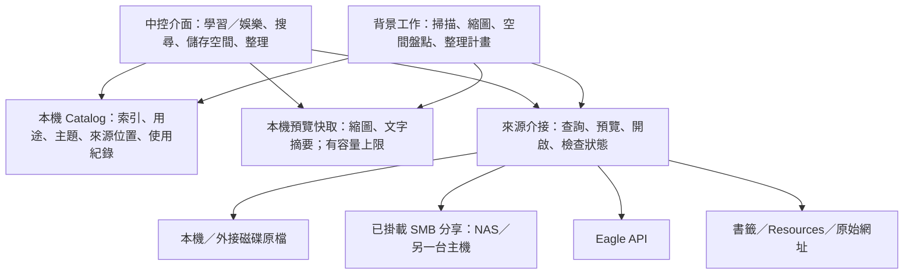

# Flowinone 中控介面：架構與操作流程草案

日期：2026-09-27。狀態：供討論的設計提案，尚未實作；現行行為仍以 [architecture.md](architecture.md) 為準。

## 產品目標

使用者從「現在想學什麼、想看什麼、想解決什麼問題」進入，在同一個介面找到分散於本機、外接磁碟、NAS、Eagle 與網頁的內容，並能預覽、開啟、管理儲存位置及整理不再需要的檔案。

核心原則是 **集中目錄與操作入口，原始內容可以分散儲存**。按主題分類不需要複製檔案；增加 SMB 連線本身也不會增加原主機的容量，必須把內容移到另一個有可用容量的設備，才會分擔原主機的儲存負擔。

初期假設：Flowinone 與資料庫運行在目前使用的 Mac；外部設備透過作業系統掛載。NAS／另一台主機的位址、容量、權限及備份條件，等實際接入時指定。

## 1. 三個彼此獨立的維度

| 維度 | 回答的問題 | 範例 |
| --- | --- | --- |
| 用途 | 我現在要做什麼？ | 學習、娛樂、未分類；同一內容可有多個用途 |
| 主題／問題 | 我要找哪類內容？ | Python、SMB 設定、攝影、電影、遊戲攻略 |
| 來源／位置 | 到哪裡讀取原始內容？ | Mac、本機外接 SSD、NAS 的某個分享、Eagle、網頁 |

例如「攝影教學影片」可以同時屬於學習與娛樂，主題為攝影，原檔只存在 NAS 一份。切換用途或主題不搬移檔案，也不製造副本。

「同一類問題」第一版用可編輯的主題標籤、關鍵字與儲存搜尋組合呈現。例如「SMB 連不上」可收納掛載教學、權限說明及相關書籤。先讓結果可預測、可修正，後續再評估是否需要語意搜尋。

## 2. 架構



- 頁面讀取索引與已快取的預覽，不在每次搜尋時掃描全部磁碟。
- 點擊內容後，依其有效位置開啟原檔、播放器、Eagle 或原始網址；多個位置可提供選擇。
- 初次盤點與後續同步由既有 Worker 執行；顯示進度、失敗原因、最近成功時間，可重試。
- 保留既有分頁與游標查詢。大量資料逐批掃描，縮圖按需產生，避免一次載入所有檔案或全量計算雜湊。
- SQLite 保留在 Flowinone 主機本機磁碟，不放到 SMB 分享上供多台機器直接讀寫。SQLite 官方說明網路檔案系統的鎖定與可靠性風險，WAL 也有同主機限制：[SQLite 官方說明](https://www.sqlite.org/useovernet.html)。
- Flowinone 自有的 Resources、使用者分類與原始 metadata 需要備份；不能把整個資料目錄當作可丟棄快取。

## 3. SMB 與儲存分工

| 儲存層 | 適合放什麼 | 中控介面的責任 |
| --- | --- | --- |
| 本機 SSD | 資料庫、預覽快取、常用原檔 | 快速搜尋與預覽，顯示使用量及快取上限 |
| 外接磁碟／NAS／其他主機 | 體積大的影片、低頻使用原檔 | 保留索引，按需讀取，標示連線與讀寫狀態 |
| 備份目的地 | 獨立的資料副本與可復原版本 | 顯示可驗證的備份資訊；移往 NAS 不自動視為已備份 |

SMB 接入流程：

1. 在提供儲存空間的設備建立分享及權限。
2. 在 **運行 Flowinone 的 Mac** 用 Finder「前往 → 連接伺服器」，輸入例如 `smb://nas.local/Media` 並完成系統登入。Apple 的操作說明見 [連接共享電腦和伺服器](https://support.apple.com/zh-tw/guide/mac-help/mchlp1140/mac)。
3. 在中控「來源管理」新增來源，設定顯示名稱及實際掛載資料夾；SMB 位址可保存為重連提示，密碼交由系統管理。
4. 檢查掛載身分、可讀性與寫入能力；初次接入預設只做索引與預覽。
5. 背景掃描完成後，內容出現在學習／娛樂／未分類與跨來源搜尋。

網頁預覽由 Flowinone 讀取已掛載檔案再回傳瀏覽器；不能假設把 `smb://…` 寫進卡片，瀏覽器就能直接播放。

每個來源須區分「線上、離線、權限不足、掃描中、掃描失敗」。來源離線時保留卡片、metadata 與已快取縮圖，標示目前無法開啟原檔。只有來源身分確認無誤、完整掃描成功後，才能判定某個檔案位置是否失效。

來源容量以磁碟區或可確認的分享容量為單位；同一磁碟區的多個資料夾不能重複加總。未知容量、權限或配額顯示未知及盤點時間，不能當作零。

## 4. 畫面與日常操作

主要導航建議為「全部、學習、娛樂、未分類」，另設「儲存空間、整理中心」管理入口。「素材／全部內容」可保留為內容範圍篩選；來源選擇放在篩選區。

```text
Flowinone                                  [搜尋主題、問題或內容…]

全部  學習  娛樂  未分類                      儲存空間  整理中心

主題：全部 / Python / 攝影 / 網路設定 / …
篩選：來源 / 類型 / 可用狀態 / 收藏 / 排序

目前主題與結果筆數                         [儲存這組搜尋]

[縮圖／摘要卡片] [縮圖／摘要卡片] [縮圖／摘要卡片] [縮圖／摘要卡片]
[縮圖／摘要卡片] [縮圖／摘要卡片] [縮圖／摘要卡片] [縮圖／摘要卡片]
```

延續現有設計偏好：桌面 4–5 欄密集、穩定網格；手機 1–2 欄；單一主要強調色。卡片顯示縮圖或類型佔位、標題、用途／主題、來源及可用狀態。文字內容以摘要支援掃讀；不用虛構封面填滿畫面。

### 流程 A：找同一類問題的內容

1. 選「學習」，再選「Python」或搜尋「處理大量檔案」。
2. 同時顯示符合條件的本機媒體、Eagle 項目、書籤與 Resources；來源不限制主題歸屬。
3. 預覽摘要／圖片，或開啟原始內容；離線項目顯示連線提示。
4. 將這組條件存為常用入口，下次直接打開。

### 流程 B：找想看的內容

1. 選「娛樂」與「電影」等主題。
2. 依類型、收藏、最近在 Flowinone 開啟或來源狀態篩選。
3. 點卡片播放支援的格式，其他格式提供原檔開啟方式。

### 流程 C：整理分類

1. 進入未分類，批次選取內容。
2. 指定用途與主題，可多選；先顯示套用範圍。
3. 更新中控自有的分類，不因來源重新同步而覆寫，也不要求改動上游資料夾。
4. 若要修改 Eagle 原生標籤，走 Eagle 既有 API 與權威流程，不直接改其 library 檔案。

本機 PDF、音訊與任意文件的統一預覽是後續擴充項目：目前 Local Catalog 只收圖片／影片，不能把新用途入口宣稱成已支援所有檔案格式。

## 5. 舊檔與容量管理

「舊」只用來找候選項目，不足以決定刪除。候選條件可包括檔案大小、修改時間、在 Flowinone 的最近開啟時間、確認完全相同的副本，以及使用者指定的保留條件。

沒有開啟紀錄代表未知，不等於從未使用；使用者可能透過其他軟體開啟檔案。檔案系統的存取時間也不當作可靠的使用歷史。

| 動作 | 實際效果 | 容量是否釋放 |
| --- | --- | --- |
| 從瀏覽隱藏 | 只改中控顯示狀態 | 否 |
| 清除可重建預覽快取 | 保留原檔、分類與必要內容資料 | 可釋放被清除的快取空間 |
| 移到其他設備 | 驗證目的地副本，切換位置，再處理來源副本 | 來源副本真正移除後才釋放來源空間 |
| 移至待清理區 | 保留復原資訊及原檔 | 同磁碟區移動通常不釋放容量 |
| 永久刪除 | 刪除已選定的實體檔案位置 | 依磁碟、快照、硬連結等情況，以盤點結果為準 |

整理流程：

1. **盤點**：列出快取、大檔、低頻使用候選及完全相同副本；視覺相似圖片僅供檢閱，不視為可刪副本。
2. **預覽計畫**：顯示名稱、完整來源位置、大小、候選原因、保留副本與預估影響的磁碟；預設排除收藏及明確保留項目。
3. **選擇動作**：保留、隱藏、移往其他儲存設備、移入可復原的待清理區。
4. **執行與記錄**：背景工作重新核對檔案身分與狀態，逐項回報成功或失敗；不因重試重複操作。
5. **復原或清空**：待清理區顯示原位置、日期與還原操作。永久清空另列明確檔案清單及大小，由使用者確認；第一版不按天數自動清空。

跨設備搬移使用「複製 → 驗證內容 → 更新有效位置 → 將來源副本移入待清理區 → 確認後清空」流程。任何一步失敗都保留已知有效副本及可續作紀錄；不直接以跨磁碟 rename 當作完成保證。可攜 metadata／sidecar 與原檔一併處理。

SMB 分享不能預設有可復原垃圾桶。未驗證回收能力時，只提供明確管理的待清理區；目的地不可寫、離線或原檔在預覽後變動時，停止該項操作並重新產生計畫。

刪除必須指定 **哪個來源的哪一份檔案**。一張卡片可對應多個來源，刪除其中一份不代表刪除全部。Chrome 書籤、Resource 記錄與本機影片的刪除意義不同，分別交給對應來源處理；本機整理功能不直接刪 Eagle library 內部檔案。

## 6. 資料模型與既有程式的銜接

以下為概念模型，實作時再確認 migration 與命名：

| 模型 | 必要資訊與責任 |
| --- | --- |
| Storage source | 穩定來源 ID、顯示名稱、介接類型、掛載路徑／分享位址、容量識別、讀寫能力、狀態、最近成功掃描 |
| Item location | 內容 ID、來源 ID、相對路徑或上游 ID、大小、修改時間、內容驗證資訊、可用狀態 |
| User classification | 內容 ID、用途、主題；獨立於來源匯入 metadata，重建 Catalog 時可重新關聯 |
| Cleanup plan / operation | 明確目標位置、預覽時的檔案版本、動作、執行狀態、結果、復原資訊 |

內容身分與實體位置分開；沿用既有 portable UID／sidecar 能力，避免換掛載路徑或搬移檔案後遺失收藏與分類。雜湊用於驗證或去重候選，不需每次瀏覽都重新計算。

### 已有、可延用

- `src/flowinone/catalog/service.py`：跨來源 Catalog、標籤、搜尋、收藏、儲存搜尋、開啟／瀏覽事件。
- `templates/navigator.html`：網格瀏覽、來源篩選、同步狀態及相同圖片檢閱入口。
- `src/file_handler/sidecars.py`：本機媒體 metadata、可攜身分與重連基礎。
- 既有持久化 Job／Worker：承接掃描與盤點；檔案變更工作另補操作紀錄與復原語意。

### 尚需補齊

- 多儲存來源登錄與位置解析。目前 `external/internal` 是路徑設定，不是完整的多主機管理模型；Local Catalog 的開啟連結仍使用 `src=external`。
- 離線容錯。`src/file_handler/item_db.py` 的 `update_item_database()` 會以路徑不存在刪掉索引紀錄；須先驗證來源與掃描完整性，不能把未掛載或存取錯誤當作刪檔。
- 用途與主題的使用者分類管理、來源重掃後的保留及搬移後重連。
- 空間盤點、快取配額、搬移、可復原待清理區與永久清空流程。
- 大量資料的可續掃描；目前 `_sync_local()` 的 100,000 筆迴圈上限須在規模擴大前處理，不能靜默截斷。
- 網路來源離線時可用的本機預覽快取；不能假設所有現有縮圖已獨立保存。

## 7. 建議實作順序與驗收

| 階段 | 交付 | 可直接驗收的結果 |
| --- | --- | --- |
| 1：內容入口 | 學習／娛樂／未分類、主題管理、批次分類、常用搜尋 | 同主題的既有四種來源一起顯示；同一項目可屬於兩種用途；重掃不丟分類 |
| 2：儲存來源 | 多來源位置、掛載檢查、離線保留、容量狀態、可續掃描 | SMB 斷線後卡片保留且標離線；重連可開啟；兩個來源同名路徑不混淆 |
| 3：整理與搬移 | 快取盤點、舊檔候選、搬移計畫、待清理區、復原及清空 | 先看具體檔案再執行；搬移失敗保留原檔；預覽後檔案變動會拒絕操作；還原不覆寫既有同名檔案 |

階段 2 的離線與身分檢查是接入 SMB 的前置條件；階段 3 的搬移／刪除必須建立在位置管理完成後。

這輪交付為架構與流程草案，沒有接入實際 SMB、搬移檔案或刪除資料。以目前本機中控為基礎即可推進；若未來要從手機或其他電腦登入中控，另補認證與網路存取設計，現行本機 Web 服務不能直接視為已支援跨設備登入。
