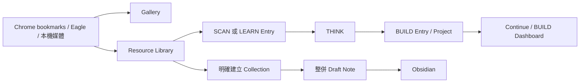

# Flowinone 知識流程與入口系統

> 本文件是 Flowinone 的現行產品與技術規格。它整合了「Resource Library」與「入口導向／BUILD Dashboard」兩份設計，並以目前已實作的 Flask + SQLite 架構為準。

## 一句話定位

> Flowinone 是一套 local-first 的入口系統，幫助使用者用最低摩擦進入正確狀態、恢復正確脈絡，並執行下一個重要行動。

它不是另一個無限內容 feed，也不把所有收藏直接倒進 Obsidian。

## 核心判斷

Flowinone 的兩個問題層次不同、但互相需要：

| 層次 | 要解決的問題 | 核心資料 |
| --- | --- | --- |
| Resource Library | 我有哪些外部素材值得處理？ | 書籤、文章、影片、PDF、GitHub、Eagle／本機媒體快照 |
| Entry System | 我現在要進入什麼狀態、從哪裡繼續？ | Entry、Project、下一步、狀態快照 |
| Obsidian | 哪些內容已被理解並形成自己的觀點？ | Literature note、synthesis、個人知識 |

因此不是建立第二個 repo 或第二套資料庫；三層共用現有 `data/flowinone.sqlite3` 與 Alembic migration。Entry 儲存「如何進入」，Resource 儲存「外部素材」，Obsidian 儲存「已內化的知識」。



## 產品原則

1. Entry 優先於 Item：內容是素材；Entry 是行動起點。
2. State 優先於 Category：一級結構是 BUILD、THINK、LEARN、SCAN、RECOVER、WRITE，而不是「技術／圖片／影片」。
3. Next Action 優先於 Description：進行中的 BUILD Entry 必須有具體下一步。
4. Resume 優先於 Discover：首頁先讓使用者續作，不先提供推薦內容。
5. Resource DB 與 Obsidian 分工：未看或尚未吸收的內容留在 Resource DB；真正有觀點的內容才升級至 Obsidian。
6. Local-first：SQLite、索引、縮圖、抽取內容預設留在本機；外部 AI 為選配。
7. 安全優先：不執行任意 shell 指令、不繞過登入／付費牆、不接受 `javascript:` 或 `data:` Entry Target。

## 六種入口模式

| 模式 | 用途 | 入口應回答的問題 |
| --- | --- | --- |
| BUILD | 立刻繼續工作或產出 | 下一步要做什麼？|
| THINK | 拆解問題、形成假設 | 問題、假設與下一步是什麼？|
| LEARN | 為已知問題主動學習 | 要學什麼、範圍與產出是什麼？|
| SCAN | 有邊界地快速探索 | 何時停止、最多看多少項？|
| RECOVER | 清楚離開工作狀態 | 我要如何恢復，而不是假裝在學習？|
| WRITE | 把已理解的內容變成可追溯輸出 | 我要產出什麼，來源與完成條件是什麼？|

`/build/` 不顯示推薦、趨勢、內容 feed 或 RECOVER 內容；RECOVER 是獨立頁面   ，避免工作與恢復混在同一個注意力空間。

## 實作架構

### 共用 SQLite schema

既有 Resource Library 表格保留：

- `resources`、`resource_origins`、`tags`、`resource_tags`
- `resource_contents`、`processing_jobs`、`ai_artifacts`
- `collections`、`collection_items`、`draft_notes`、`draft_note_sources`
- `resource_note_links`、`note_exports`、`resource_fts`

Entry System 從 migration `0002_entry_system` 開始，現行 schema 已演進至 migration `0006_typed_entry_links`：

| 表格 | 責任 |
| --- | --- |
| `projects` | 多個 Entry 的工作脈絡、goal、current entry、next action 與可攜連結 metadata |
| `entries` | Target + Context + State + Action 的狀態化入口 |
| `entry_events` | 建立、更新與進入 Entry 的本機 audit trail |
| `entry_links` | `entry_id + linked_type + linked_id + direction`；保存多個 Entry／Resource／Collection／Gallery item／輸出的 typed provenance |

### Entry 資料模型

```text
Entry
├── name / mode / kind / status
├── target: type + validated URI
├── context: 來源、Project、關聯資訊
├── state: query、filters、sort、layout、focus 等 JSON snapshot
├── next_action / last_action
├── project_id
├── source_entry_id       # 舊版相容欄位；新關聯以 entry_links 為準
└── entered / updated / completed timestamps
```

`mode` 為 `build | think | learn | scan | recover | write`；`status` 為 `active | blocked | completed | archived`。

Project 不等於資料夾。它保存的是可恢復的工作脈絡，包括 goal、下一步、目前 Entry、repository／note／view JSON metadata。

### Target 執行安全模型

Entry 可指向：

- Flowinone 內部路徑，例如 `/resources/?reading_state=unread`
- `https://`／`http://` 網址
- `obsidian://`、`vscode://`、`eagle://`、`file://` 使用者明確建立的本機 URI

進入 Entry 時會更新 `last_opened_at` 與事件紀錄，然後只做受驗證的 redirect。`on_enter` JSON 可以作為可攜 metadata 保存，但網頁端不會執行任意 process、shell 或腳本。

## Resource Library 流程

```text
Chrome JSON / HTML / 單一 URL
    → canonicalization + URL hash 去重
    → Resource DB + source placement
    → durable processing_jobs
    → metadata / favicon / thumbnail / extracted text
    → optional AI summary / tags / Ask AI
    → FTS5 + filters
    → Collection / Draft Note / Obsidian
```

### Resource 狀態責任

目前實作用三個獨立欄位，避免把閱讀、處置與可用性混成一個難以擴充的狀態：

| 維度 | 值 |
| --- | --- |
| `reading_state` | `inbox`、`unread`、`skimmed`、`reading`、`digested` |
| `disposition` | `active`、`archived`、`rejected` |
| `availability` | `unknown`、`available`、`dead`、`blocked`、`auth_required` |

Promote 到 Obsidian 透過 `resource_note_links` 與 `note_exports` 追蹤，而不是把「promoted」混入閱讀狀態。

### 已實作的資源能力

- Chrome Profile JSON、Chrome HTML 與單一 URL 匯入。
- canonical URL、SHA-256 去重與多資料夾 placement 保留。
- Article、YouTube、GitHub、PDF 與一般網頁的 extractor routing。
- 本機 favicon、PDF 首頁 WebP、既有書籤縮圖快取整合與 placeholder fallback。
- SQLite FTS5：標題、摘要、使用者筆記與抽取文字可搜尋。
- 標籤、優先度、閱讀流程、archive／reject、相似資源、背景工作重試。
- 選配 OpenAI-compatible／LM Studio AI：摘要、標籤、why-this-matters、僅依已抽取內容回答的 Ask AI。
- 混合來源靈感 Collection、synthesis/literature Draft Note、安全 Obsidian export。

### 明確的邊界

- AI 未設定時，匯入、搜尋、狀態管理、Collection 和 Obsidian 仍然可用。
- Resource markdown mirror 是衍生備份，不是 source of truth。
- OCR 已有 versioned artifact/provider 基礎，但 provider 為選配；仍不做完整網頁離線鏡像、付費牆繞過、Cookie 儲存或 Obsidian 雙向同步。
- 向量／embedding 不作為搜尋必要依賴；目前以 Catalog FTS5 與可解釋 relation graph 提供跨來源搜尋與相似度。

## Entry 與資源的串接

### BUILD Dashboard

預設首頁 `/` 會導向 `/build/`。Dashboard 只有：

1. Continue：從 active BUILD Entries 選出最適合恢復的一筆。
2. New：Project、Coding Task、Experiment、Note、Draft、Blank Build Entry 模板。
3. Think → Build：由 Problem、Hypothesis、Next Action 產生完成的 THINK Entry 與 active BUILD Entry。
4. Current Project：顯示目前工作脈絡與 Project 下一步。
5. Recent Build Entries。
6. Blocked / Waiting。

Continue 的排序偏好 active Project、Project 的 current entry、有 next action 與最近開啟時間；blocked Entry 不會成為 Continue。

### State snapshot

Resource Flow 頁面可將目前的搜尋、閱讀狀態、類型、tag、domain、排序與 grid layout 儲存成 `view_entry`。再次進入時，Flowinone 會還原支援的 Resource query filters。

這使得「未讀 RISC-V 資源，以最新排序」成為一個可重複進入的工作入口，而不只是一次性 URL。

### 跨來源轉換

| 起點 | 可建立的 Entry | Target |
| --- | --- | --- |
| Resource 詳細頁 | LEARN、BUILD | Resource 詳細頁 |
| Resource view snapshot | LEARN、SCAN、BUILD | 還原後的 Resource 篩選 |
| 靈感 Collection | BUILD | Collection 詳細頁 |
| Draft Note | BUILD | Note 詳細頁 |
| Eagle／本機圖片或影片 | LEARN、BUILD | 原本媒體詳情頁 |

這些關聯以安全 URI 與 context snapshot 保存，避免把 Eagle、檔案系統、Resource DB 強行耦合成單一不可攜資料模型。

## 路由與 API

### UI

| 路徑 | 用途 |
| --- | --- |
| `/` | 預設導向 BUILD |
| `/build/` | BUILD Dashboard |
| `/think/`、`/learn/`、`/scan/`、`/recover/`、`/write/` | 六種模式的專用入口 |
| `/entries/`、`/entries/<id>/` | Entry registry 與編輯頁 |
| `/projects/`、`/projects/<id>/` | Project registry 與脈絡頁 |
| `/library/` | 原有內容探索工作台（不再是預設首頁） |
| `/resources/`、`/inspiration/`、`/notes/` | Resource、靈感 Collection、整併筆記 |

### Entry API

```text
GET    /api/dashboard/build
GET    /api/entries
POST   /api/entries
GET    /api/entries/{id}
PATCH  /api/entries/{id}
DELETE /api/entries/{id}
POST   /api/entries/{id}/enter
POST   /api/entries/{id}/transition
POST   /api/entries/think-to-build

GET    /api/projects
POST   /api/projects
GET    /api/projects/{id}
PATCH  /api/projects/{id}
DELETE /api/projects/{id}
```

Resource API、Collection、Draft Note、Obsidian export 與 maintenance CLI 保持原有路徑；詳見 [README](../README.md)。

## Obsidian 邊界

Resource DB 保存「我可能需要的外部東西」；Obsidian 保存「已成為我知識的一部分」。

Promote 會建立可編輯的 literature note，包含來源 URL、摘要、個人觀點欄位、與既有知識的連結、可用 Project、下一步行動。輸出採 vault-contained、原子寫入與衝突保護：已被使用者編輯的檔案不會自動覆蓋。

設定方式：

```bash
export OBSIDIAN_VAULT_PATH="$HOME/Documents/你的Vault"
export OBSIDIAN_TARGET_FOLDER="Resources/Digested"
```

## 操作與資料維護

### 啟動與 migration

```bash
conda run -n py3.11 python run.py
conda run -n py3.11 flask --app run entries-db-upgrade
```

應用程式啟動時會自動升級 shared SQLite database；第二條指令可在部署前明確執行 migration。

### 備份

`data/` 是本機資料的主要保存位置。停止應用程式後複製整個目錄即可備份 SQLite、內容、縮圖與 exports：

```bash
cp -a data "$HOME/Backups/flowinone-$(date +%Y%m%d)"
```

### 已驗證的品質門檻

- 空資料庫可從 Alembic migrations 建立 Resource 與 Entry schema。
- Entry API、Project、Continue、Think → Build、state restore、SCAN 邊界與 unsafe URI rejection 有 integration tests。
- Resource、Eagle／本機媒體、Collection、Draft Note 保留原有流程並可建立 Entry。
- UI 以 semantic tokens、44px 以上操作目標、keyboard focus、行動版 layout 與 reduced-motion 為基準。

## 現行 Catalog、Collection 與 Sidecar

Local、Eagle、Chrome Bookmark 與 Resource 仍各自是 authority；`catalog_*` 表是可重建查詢投影。Gallery、跨來源 Search、Smart Collection 與推薦共用這個投影。相同 canonical URL 只建立一個 Catalog item，仍保存所有 origins。

Collection 支援 `manual`、`smart` 與 `generated`。Generated Collection 先建立 draft，必須由使用者確認才 active；重新生成不覆寫人工修改。

本機媒體使用目錄級 `.flowinone.json` sidecar 保存 portable UID、fingerprint 與人工 metadata。DB 是查詢投影；sidecar 不保存 absolute path、thumbnail cache、AI 暫存結果或 DB row ID。

## 下一階段

1. 以真實樣本 benchmark OCR／face provider，加入匿名人物 cluster merge/split UI。
2. 根據 `catalog_events` 的真實使用資料調整推薦權重，維持每筆可解釋 reason。
3. 強化 Eagle 大型 library 的完整增量同步與同步進度顯示。

跨裝置同步、自動 Raw → Wiki、Obsidian 雙向同步與 OneTab／Keep／Notion／社群 connectors 明確不在本 repo 範圍。
6. 非破壞性的 Entry／Project 匯出與匯入。

## 決策準則

每次新增功能前，先問：

```text
這個功能是讓使用者更快進入狀態，
還是只是讓使用者看到更多東西？
```

若它不能降低 resume cost，通常不應搶占 BUILD Dashboard 的注意力。
