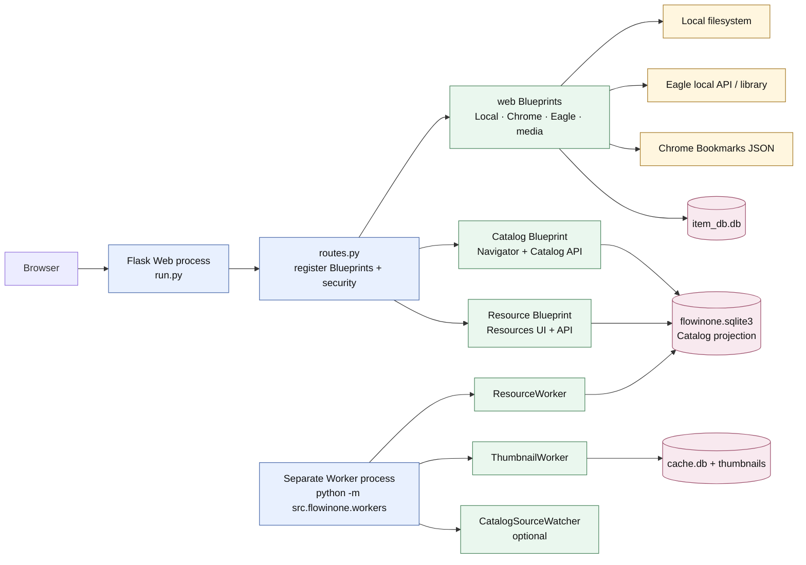
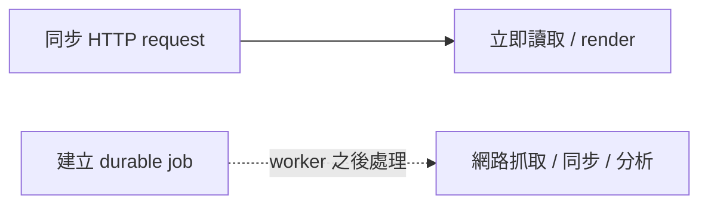
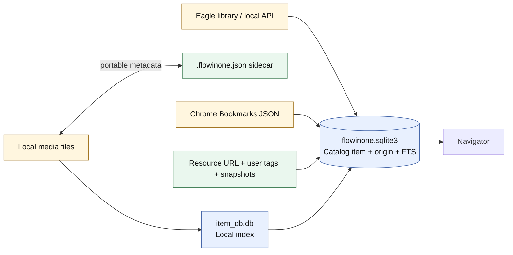
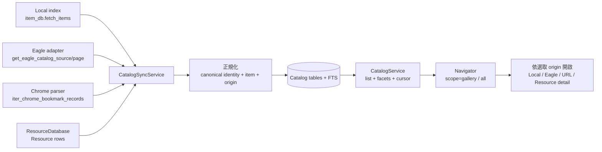
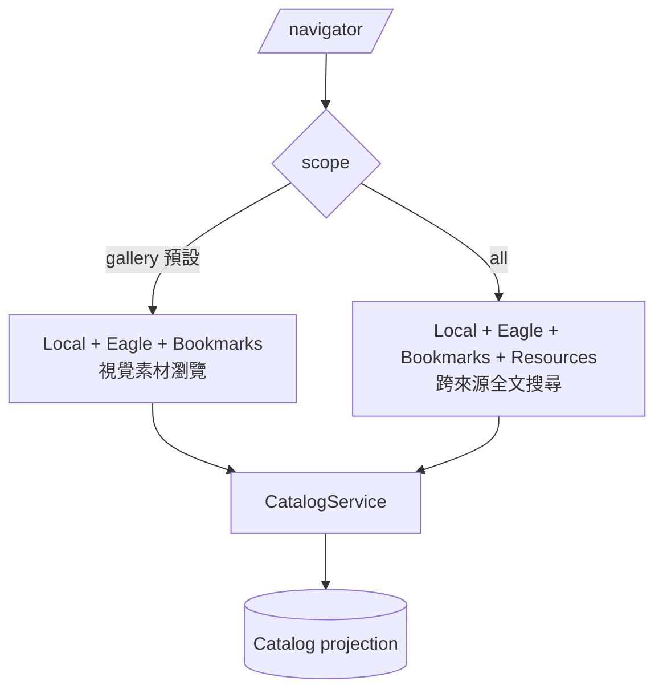
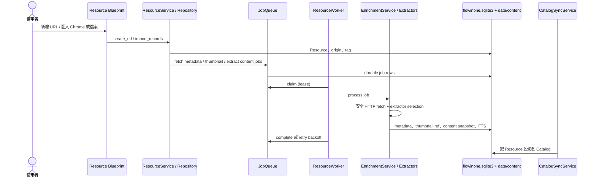
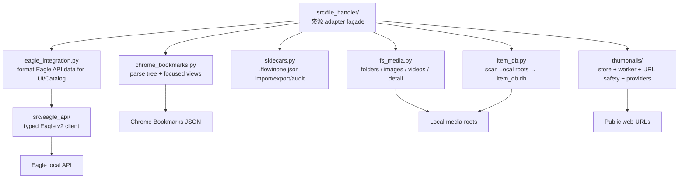
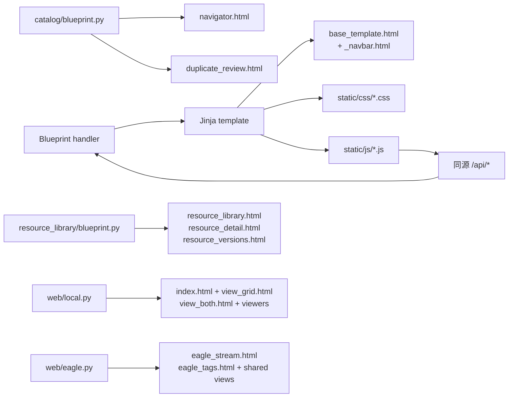
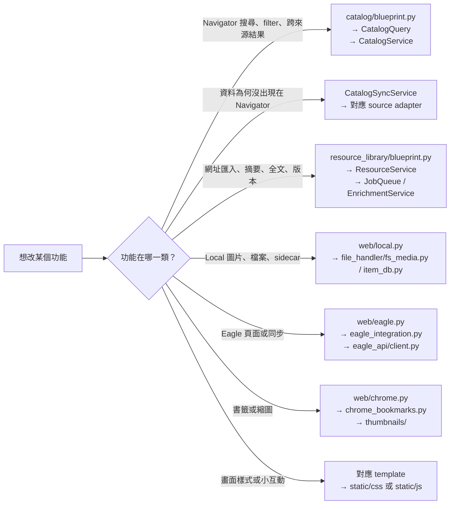

# Flowinone 程式碼架構圖（從入口讀懂整個 repo）

> 這份文件以目前程式碼的 import、Blueprint 註冊、worker dispatch 與資料庫模型為準。
> 想知道系統「提供什麼功能」請讀 [architecture.md](architecture.md)；想從程式碼下手，請從本頁開始。

## 先記住這一句

**Flowinone 不把四個來源搬進自己的新系統；它把來源資料投影成可重建的 Catalog，然後用 Flask 顯示。**

因此要先分清楚兩個東西：

- **權威資料（source of truth）**：Local 檔案、Eagle library、Chrome `Bookmarks`、以及 Flowinone 自己建立的 Resource。
- **Catalog projection**：把上述來源變成可跨來源搜尋、篩選與瀏覽的一份 SQLite 索引。它可以重建，不能拿來直接覆寫來源 metadata。



### 線條怎麼解讀



接下來每張圖都遵守這個意思：實線是目前 request 會做的事；虛線代表丟進持久化 job queue、由 worker 稍後做。

## 1. 先從兩個程序看全局

這不是「Flask 啟動後所有功能都會跑」的程式。至少需要 Web 與 Worker 兩個程序。

```mermaid
flowchart TB
  user[使用者瀏覽器]
  web[Web process<br/><code>python run.py</code><br/>bind 127.0.0.1:5894]
  worker[Worker process<br/><code>python -m src.flowinone.workers</code>]

  user -->|頁面、JSON、表單| web
  web -->|讀寫| main[(data/flowinone.sqlite3)]
  web -->|讀取| item[(data/item_db.db)]
  web -->|讀取 thumbnail 狀態| cache[(data/cache.db)]
  web -->|立即讀來源| local[Local media roots]
  web -->|立即讀來源| eagle[Eagle local API]
  web -->|立即讀來源| bookmarks[Chrome Bookmarks file]

  web -.|queue job| main
  worker -->|claim / complete / retry job| main
  worker -->|縮圖 cache| cache
  worker -->|內容快照| content[data/content/]
  worker -->|安全的 public HTTP fetch| internet[Public Internet]
  worker -->|觀察來源變化，可選| local
  worker -->|觀察來源變化，可選| eagle
  worker -->|觀察來源變化，可選| bookmarks
```

### 兩個程序各自負責什麼？

| 程序 | 入口 | 要做的事 | 故意不做的事 |
| --- | --- | --- | --- |
| Web | `run.py → create_app()` | 註冊 routes、驗證 request、render Jinja、同步讀取來源與 SQLite、把耗時工作排入 queue | 不會自行啟動 worker，也不會在一般 request 中抓網路內容 |
| Worker | `src/flowinone/workers.py → WorkerRuntime` | 同時管理 thumbnail worker、Resource worker、可選 source watcher | 不提供 HTTP routes |

`WorkerRuntime` 建了三條 thread：`ThumbnailWorker`、`ResourceWorker`、`CatalogSourceWatcher`（若啟用）。其中 `ResourceWorker` 會從同一個 durable queue 取 `catalog_sync`、`catalog_similarity` 與 Resource enrichment jobs；所以它的名字雖然是 Resource worker，實際上也承接 Catalog 的背景工作。

## 2. Web request 從哪裡走到哪裡？

```mermaid
flowchart TB
  run[run.py<br/>create_app()] --> config[config.py<br/>讀設定、確認 Local roots]
  run --> registration[routes.py<br/>register_routes(app)]
  registration --> security[web/security.py<br/>Host allowlist + Origin + CSRF]
  registration --> errors[web/api.py<br/>Pydantic input/output 驗證與 API error]
  registration --> localbp[web/local.py]
  registration --> chromebp[web/chrome.py]
  registration --> eaglebp[web/eagle.py]
  registration --> mediabp[web/media.py]
  registration --> catalogbp[catalog/blueprint.py]
  registration --> resourcebp[resource_library/blueprint.py]

  localbp --> templates[Jinja templates/]
  chromebp --> templates
  eaglebp --> templates
  mediabp --> templates
  catalogbp --> templates
  resourcebp --> templates
  templates --> static[static/css + static/js<br/>vanilla JavaScript]
```

可把 `routes.py` 當成總配電盤：它只做註冊，不處理真正的功能。真正功能分在七個 Blueprint：

| Blueprint / 檔案 | 面向使用者的入口 | 主要轉交給 |
| --- | --- | --- |
| `web/local.py` | `/`、`/library/`、`/folders/`、`/grid/...`、`/item_db` | `file_handler.fs_media`、`item_db`、`sidecars` |
| `web/chrome.py` | `/chrome/`、書籤縮圖 API | `chrome_bookmarks`、`ThumbnailStore/Worker` |
| `web/eagle.py` | `/EAGLE_*`、`/search`、Eagle stream API | `file_handler.eagle_integration` |
| `web/media.py` | `/image/...`、`/video/...`、`/serve_image/...` | 安全路徑檢查後的 local media renderer |
| `catalog/blueprint.py` | `/navigator/`、`/api/catalog/*`、`/gallery/`/`/search/` 相容 redirect | `CatalogService`、`CatalogSyncService`、relations、similarity、watcher |
| `resource_library/blueprint.py` | `/resources/`、`/api/resources/*` | `ResourceService`、`ResourceRepository`、versions、jobs |
| `routes.py:debug_bp` | `/debug/` | 只有 `FLOWINONE_DEV_TOOLS` 為真才註冊 |

## 3. 資料來源與「誰可以被改」



| 資料 | 實際權威 | Flowinone 裡的對應程式 | 正確的修改方式 |
| --- | --- | --- | --- |
| Local 圖片、影片、目錄 | 原始檔案系統 | `file_handler/fs_media.py`、`item_db.py` | 不經 Catalog 寫入；可用 `sidecars.py` 保存 Flowinone metadata |
| Eagle item / folder / tag | Eagle | `eagle_api/client.py`、`file_handler/eagle_integration.py` | 經 Eagle local API 修改，再做 Catalog sync |
| Chrome bookmark tree | Chrome 的 `Bookmarks` JSON | `file_handler/chrome_bookmarks.py` | Flowinone 讀取、投影、可匯入成 Resource；不把 Catalog 當 Chrome 編輯器 |
| Imported Resource | `flowinone.sqlite3` + `data/content/` | `resource_library/*` | Flowinone 自己管理 URL、標籤、擷取內容、版本與 jobs |
| Cross-source items / origins / FTS / sessions | `flowinone.sqlite3` | `catalog/service.py` | 可由四來源重新同步；不要把它當原始 metadata 的回寫點 |
| Local index | `data/item_db.db` | `file_handler/item_db.py` | 可掃描 Local roots 重建 |
| 縮圖、縮圖 jobs、cache | `data/cache.db` + `data/thumbnails/` | `file_handler/thumbnails/*` | 可重新產生 |

## 4. 最核心：Catalog 是怎麼把四個來源合成一個列表？



### 三個關鍵類別（最值得先讀）

| 檔案 / 類別 | 它在想什麼 | 主要責任 |
| --- | --- | --- |
| `catalog/service.py → CatalogSyncService` | **把來源變成 projection** | 讀 Local/Eagle/Bookmarks/Resources；canonicalize；upsert item 與 origin；保存 sync status；Eagle 支援可恢復 cursor |
| `catalog/service.py → CatalogService` | **從 projection 讀出 Navigator** | query、FTS、facets、keyset cursor、origin selection、favorite/open event、瀏覽 session、saved search |
| `catalog/service.py → CatalogQuery` | **把 HTTP query string 收斂為一個查詢物件** | `scope`、sources、tags、type、日期、favorite、sort、cursor 的 validation / signature |

### Navigator 的兩個 scope



`/gallery/` 與 `/search/` 不再是兩套功能；它們只是相容 redirect，分別導向 `scope=gallery` 與 `scope=all`。

## 5. Resource：URL 從匯入到可搜尋內容



### Resource 模組分工

| 模組 | 角色 |
| --- | --- |
| `database.py` | SQLAlchemy engine/session、Alembic upgrade、backup、SQLite transaction / lock |
| `models.py` | ORM tables：`Resource`、`ResourceOrigin`、tags、content、jobs、AI artifact、app state |
| `repository.py` | 純資料庫 CRUD、Resource FTS、相似 Resource 查詢 |
| `service.py` | 匯入 Chrome / HTML、建立 URL、更新 tag、排入 enrichment jobs |
| `jobs.py` | durable SQLite queue：idempotency key、lease、complete、retry backoff |
| `worker.py` | 取 job 並執行；也 dispatch `catalog_sync` 與 `catalog_similarity` |
| `enrichment.py` | 寫 content snapshot、metadata、縮圖、AI 結果，並處理 job 類型 |
| `extractors.py` | Generic web、PDF、YouTube、GitHub extractor；限制 public HTTP / 回應大小 |
| `versions.py` | 同一 Resource 的內容版本與 bounded unified diff |
| `canonical.py` | URL / tag normalize、hash、path containment |
| `ai.py` | 可選的 OpenAI-compatible summary / Q&A，不是正常瀏覽的必要依賴 |

## 6. Local、Chrome、Eagle adapter 層

這層的工作是「讀來源並轉成 app 能用的資料」，不是跨來源搜尋；跨來源搜尋只應進 `catalog/`。



| 子系統 | 先讀哪裡 | 什麼時候需要深入讀 |
| --- | --- | --- |
| Local folder / viewer | `web/local.py` → `file_handler/fs_media.py` | 修改目錄瀏覽、圖片或影片 detail |
| Local index | `file_handler/item_db.py` | Navigator 漏資料、duplicate / similarity 找不到 local image |
| Local metadata sidecar | `file_handler/sidecars.py` | 匯出、匯入、搬檔 relink、portable metadata |
| Chrome | `web/chrome.py` → `file_handler/chrome_bookmarks.py` | 書籤 tree、bookmark thumbnail 或匯入流程 |
| Eagle | `web/eagle.py` → `file_handler/eagle_integration.py` → `eagle_api/client.py` | Eagle page、分頁、能力偵測或 Catalog sync |
| Thumbnail | `thumbnails/store.py` → `thumbnails/worker.py` | cache、queue lease、網路縮圖失敗、provider 規則 |

## 7. HTML、CSS、JavaScript 在哪裡接上？



前端不是 React / SPA。大部分 filter 是帶 query string 的整頁 navigation；僅少量互動以 vanilla JavaScript 呼叫同源 API：

- `navigator_commands.js`：Navigator command palette / saved search 操作。
- `navigator_sync.js`：排入 Catalog sync 與輪詢 job status。
- `navigator_watch.js`：來源觀察的設定與狀態。
- `navigator_similarity.js`：相似圖片分析的 job / 結果。
- `duplicate_review.js`：duplicate canonical selection 與安全 reveal。

## 8. Repo 目錄地圖（每個目錄該怎麼看）

```text
Flowinone/
├── run.py                         # Flask application factory + dev server
├── routes.py                      # 所有 Blueprint / CLI 的註冊點
├── config.py                      # Local root、Chrome path 等設定與互動式確認
├── src/
│   ├── flowinone/
│   │   ├── web/                   # HTTP adapters（來源專屬頁面、media、安全、API schema）
│   │   ├── catalog/               # 跨來源 projection、Navigator、sync、relations、similarity、watch
│   │   ├── resource_library/      # Flowinone 自有 URL/內容/worker domain
│   │   ├── workers.py             # 獨立 worker process runtime
│   │   └── paths.py               # 全部 data path 的共同根
│   ├── file_handler/              # Local / Chrome / Eagle adapters、Local index、sidecar、thumbnails
│   └── eagle_api/                 # Eagle v2 HTTP client 與 typed value objects
├── templates/                     # server-rendered Jinja pages
├── static/                        # vanilla CSS / JS / fallback SVG
├── migrations/                    # flowinone.sqlite3 的 Alembic schema history
├── scripts/                       # 小型、一次性的 maintenance entry points
├── tests/                         # pytest；browser/ 是 Navigator browser integration tests
├── data/                          # runtime data，通常不應直接手改
└── docs/                          # 產品、架構、schema、流程與此程式碼導覽
```

### 測試要怎麼對應功能？

| 測試群組 | 保護的邊界 |
| --- | --- |
| `test_app_architecture.py`、`test_security_and_runtime.py` | app factory、worker 分離、local-only security、migration runtime 行為 |
| `test_catalog_*.py`、`test_navigator_*.py` | Catalog sync/query、Eagle sync、source watch、similarity、舊 URL 相容 |
| `test_resource_*.py` | URL import、enrichment、content versions、Resource routes |
| `test_thumbnail_*.py`、`test_chrome_no_network.py` | URL safety、provider、thumbnail cache / worker、Chrome adapter |
| `test_eagle_api_v2.py` | Eagle client / capability / pagination contract |

## 9. 建議的閱讀路線

依你的目的選一條路即可，不需要一次讀完 `catalog/service.py`（它目前約 1,900 行，是 repo 最大的核心檔）。



### 修改前的三個安全問題

1. 這是要改「來源權威資料」還是「Catalog projection」？前者不應直接寫 Catalog。
2. 這件事能在 HTTP request 完成嗎？若需要網路、掃描大量檔案或長時間運算，應建立 `ProcessingJob` 讓 worker 處理。
3. 我改的是 source-specific adapter 還是 cross-source 行為？前者放 `web/` 或 `file_handler/`；後者才放 `catalog/`。

## 10. 幾個容易誤解的地方

- `resource_library` 與 `catalog` 共用 `flowinone.sqlite3`，但職責不同：前者擁有 Resources；後者是多來源 projection 與 Navigator。
- `file_handler.py` 是舊 import 相容 shim；實作在 `src/file_handler/`。
- `data/item_db.db`、`data/cache.db` 由 raw `sqlite3` 在 runtime 自管 schema；`data/flowinone.sqlite3` 才由 SQLAlchemy + Alembic 管理。
- `CatalogSourceWatcher` 只負責偵測穩定變化並排 job，不直接做同步。
- `ThumbnailWorker` 與 `ResourceWorker` 是獨立的工作迴圈；Web process 不會因為按了按鈕就同步把工作做完。
- `migrations/0007_renderer_only_cleanup.py`、`0008_renderer_resource_schema.py` 已移除舊 knowledge-workflow / personal-note 系統；不要把舊 migration 中的 models 當目前產品架構。

## 11. 一分鐘維護檢查表

| 我想做什麼 | 最可能的落點 |
| --- | --- |
| 新增 Navigator filter | `CatalogQuery`、`CatalogService.list/facets`、`catalog/blueprint.py`、`navigator.html` |
| 新增一種 Catalog source | `CatalogSyncService` + source adapter + canonical/origin schema + Navigator scope / schema + tests |
| 新增 Resource extractor | `resource_library/extractors.py`、`EnrichmentService`、enrichment tests |
| 新增背景任務 | `JobQueue` priority + `ResourceWorker._process` 或 `EnrichmentService.process_job` + job test |
| 新增 Local metadata 欄位 | `SidecarService`、`item_db`、Catalog normalisation；確認可攜與重建語意 |
| 改 Eagle API 行為 | `eagle_api/client.py`（HTTP contract）→ `eagle_integration.py`（app-shaped adapter）→ `web/eagle.py` |
| 改 API contract | `web/schemas.py` + `web/api.py` + 相關 Blueprint 測試 |

---

若只想知道「下一個檔案要開哪一個」：先看 [run.py](../run.py)、[routes.py](../routes.py)，再依需求挑本頁第 9 節的一條閱讀路線。這樣會比從最大的 `catalog/service.py` 正面硬讀容易得多。
